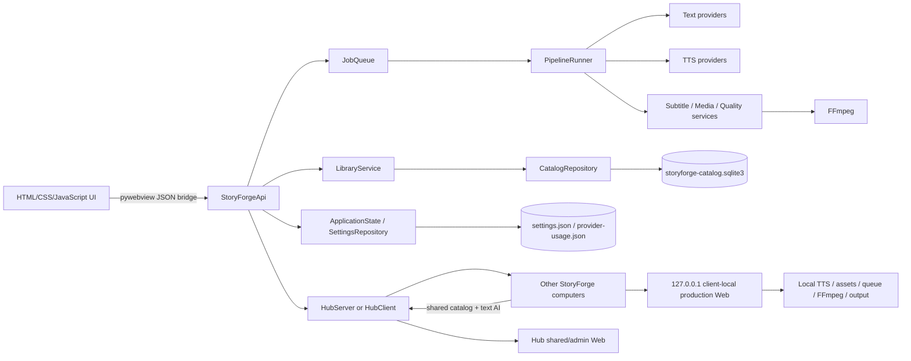
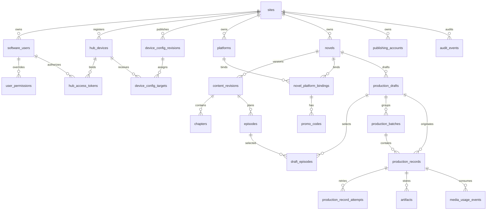
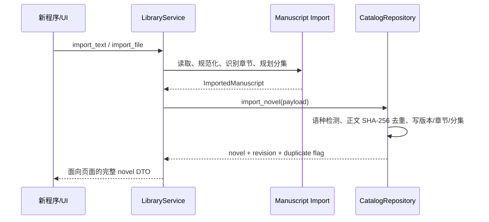
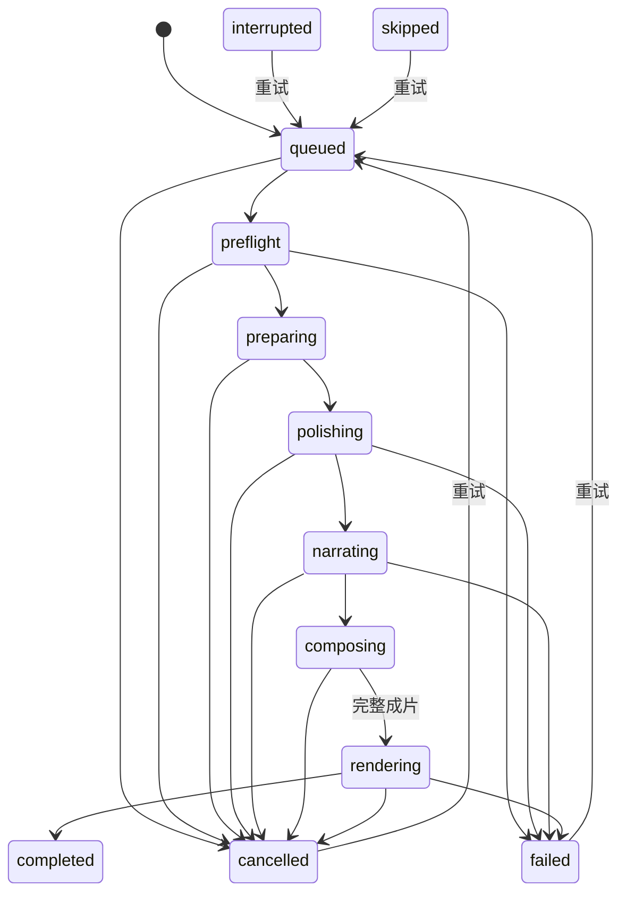
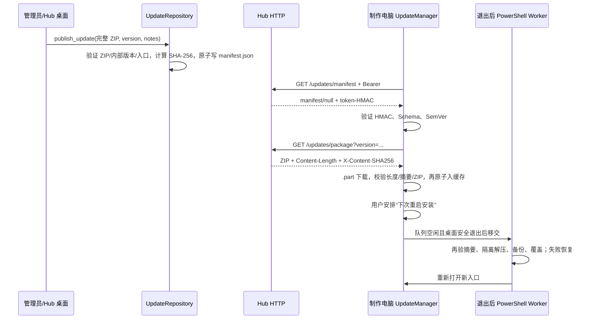
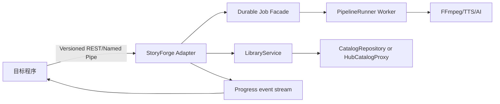

# StoryForge Studio 整体项目与功能嫁接说明书

> 文档用途：供后续开发团队将 StoryForge 的小说资料、分集规划、文案处理、配音、字幕、素材编排、浏览器即时预览、批量渲染、生产记录和多电脑协同能力嫁接到其他程序。
>
> 基准日期：2026-07-30  
> 当前源码版本：`storyforge.__version__` 0.4.0-rc7  
> 数据库 Schema：12  
> 设置 Schema：18  
> Hub 协议：1  
> Local Worker / 浏览器协议：2  
> 成片 Manifest：2
> 更新清单 Schema：1；更新包元数据：1；生产方案 `recipe_version`：1；生产预设 Schema：2
>
> 解释优先级：本报告前部的“0.4.0 当前嫁接合同”覆盖后文明确标为历史兼容的 0.3.x 描述；后文未冲突的实体、接口和兼容合同继续有效。当前本机构建验收候选物为 `D:\StoryForgeBuildTemp\release\rc7-final\StoryForge Studio\`，冻结态启动、内置 FFmpeg 与 Kokoro 实际合成自检均通过；更新包已发布到 Hub，但它仍需在实际员工电脑完成跨机冒烟后才能改称正式生产版。

---

## 1. 文档结论

StoryForge 不是单纯的 FFmpeg 脚本，而是一套 Windows 本地优先的小说视频生产系统。它已形成七个相对独立的能力域：

1. **长期资料域**：小说、正文版本、原始章节、制作分集、封面、平台、口令、人工发布账号。
2. **生产编排域**：通过可视小说选择器按批次选择小说、平台、口令、分集、女声、字幕、素材、视频模板和生成总数；在浏览器即时预览后直接创建完整视频任务。
3. **内容与媒体域**：正文清洗、AI/规则润色、题材分类与人工覆盖、TTS、字幕时间轴、素材去重、音乐匹配、FFmpeg 渲染和快速质检。
4. **生产追踪域**：按“小说 → 批次 → 逻辑任务 → 尝试次数”归类状态；支持失败继续、保留历史的重试、带操作者/时间/原因的取消、可恢复归档、管理员回收站、产物登记、素材使用次数和审计记录。
5. **协同域**：一台 Hub 主机持有权威 SQLite 数据库，多台制作电脑通过带权限的 HTTP RPC 和文件接口协同。
6. **发布更新域**：Hub 主机发布经结构和摘要校验的完整 ZIP；制作电脑按周期检查、下载并校验，只有在用户安排且渲染空闲后才于安全退出时替换程序文件。
7. **网页生产域**：Hub 主机网页承担共享资料与管理；每台已登记制作电脑提供仅限本机 `127.0.0.1` 的生产网页，调用该电脑自己的 TTS、字幕、素材、队列和 FFmpeg。正常地址不使用 Mock 数据。

后续嫁接时，**推荐保留 Python 核心并在外层增加版本化适配 API**。不建议让新程序直接读写 SQLite，也不建议把 `ui/app.js` 当成业务规则来源。最值得直接复用的核心是：

- `CatalogRepository`：长期业务数据和并发规则；
- `LibraryService`：面向页面/业务的组合服务；
- `prepare_manuscript*`：文件读取、分集识别和分集规划；
- `PipelineRunner`：从正文到 MP4 的完整流水线；
- `JobQueue`：本机串行渲染状态机，与 Catalog 中的持久 Job 快照、批次顺序和启动恢复合同共同工作；
- `HubServer` / `HubClient`：局域网目录共享、权限和任务租约；
- `StoryForgeApi`：现有桌面桥接层，可作为新适配器的参考，但不应直接定义未来公共 API。

### 1.1 0.4.0 当前嫁接合同（兼容 0.3.4）

- **网页与桌面是同一业务产品，媒体运行端不同。**桌面 WebView、Hub 团队网页和制作电脑 loopback 网页复用同一 UI 和账号权限。Hub 网页可发起试听、目录选择、完整建队、队列控制和失败重试，但前端必须先通过一次性设备票据连接访问者电脑上只监听 `127.0.0.1:18765–18770` 的 Local Worker；`WEB_DESKTOP_ONLY_MEDIA_METHODS` 继续阻止这些方法落到 Hub 主机进程。
- **完整窗口无需常开。**员工发布包在 EXE 同级携带不含密钥的 `storyforge-connection.json`。全新制作电脑只输入账号和 8 位密码；软件自动读取 Windows 电脑名称、登记安装身份、用 DPAPI 保存内部设备凭据，并静默注册登录触发的 `StoryForge Local Worker`。员工不填写 Hub 地址、不复制令牌、不运行脚本。`admin-tools` 中的启用/停用脚本仅保留为管理员维修入口。集成到其他程序时应保留这个独立 Worker 生命周期，不要把媒体能力绑死在可见窗口。
- **数据与算力归属冻结。**Hub 保存小说库、正文版本、封面、平台/口令、成员、大模型配置与用量、团队生产预设、草稿、生产记录、产物元数据/校验和审计；员工电脑保存视频、音乐、本机 TTS/FFmpeg/GPU 运行时、语音缓存、临时文件、ASS、内部 WAV、历史预览和最终 MP4/MP3。管理员不配置员工文件夹，跨电脑草稿中的绝对路径不得继承，也不能经 Hub 播放或下载员工本地成片。
- **本机健康状态成为 Worker 合同。**Local Worker 的连接结果返回经过脱敏的 `app_version / ffmpeg_ready / ffmpeg_label / encoders / recommended_encoder / tts_provider / tts_ready / edge_tts_runtime_ready / embedded_kokoro_ready / kokoro_configured / tts_endpoint_configured / tts_api_key_configured`。网页必须用这组当前电脑状态展示 FFmpeg/Kokoro，不得误用 Hub 主机检测或浏览器能力。
- **Kokoro 版本边界明确。**轻量版包含界面、本机制作服务和 FFmpeg，但不含进程内 Kokoro/PyTorch；它可以使用 Edge TTS、Deepgram 或 OpenAI-compatible Kokoro HTTP 服务。`-WithLocalAI` 完整版才可在 Kokoro 地址留空时使用内置运行时和 `local-ai\kokoro` 离线资产。网页显示“轻量版，Kokoro 还未配置”是能力状态，不是网页故障。
- **封面结尾可关闭。**`production_settings.cover_outro_enabled`、`AppSettings.cover_outro_enabled` 与冻结到 `RenderJob.cover_outro_enabled` 的值默认 `true`。值为 `false` 时 FFmpeg 计划不插入小说封面或封面动画，保持正文画面完成结尾；CTA 旁白、当前字幕样式、BGM 和顶部搜索口令仍继续。旧草稿没有字段时迁移为 `true`。
- **输出合同固定为二选一。**Settings Schema 18 使用 `production_settings.output_mode` / `BatchSpec.output_mode`：默认 `video_and_mp3`，完整 MP4 通过快速质检后复用内部 `narration.wav`，再交付与成片同基名的 48 kHz、192 kbps 纯旁白 MP3；显式 `audio_only` 跳过视频渲染，只交付 MP3。MP3 不含 BGM 或素材原声，且不得再次调用 TTS。产品不再提供 video-only。MP4 与 MP3 都先写私有临时路径，只有合同内全部产物成功后才原子发布正式文件；失败不会留下可被员工误发的正式名残片。
- **旧字段只作安全迁移。**旧 `export_narration_audio=true`、`false` 或缺失都迁移为 `output_mode=video_and_mp3`，不能根据旧布尔值关闭 MP3；只有显式 `output_mode=audio_only` 才进入纯音频模式。最终路径写入 `RenderJob.output_file` / `narration_audio_file`、Manifest、生产记录与对应 `video` / `narration` Artifact；`audio_only` 只登记 `narration`，不得把 MP3 伪装成视频 Artifact。
- **生产媒体始终不跨机共享。**`settings.hub.share_narration` 与旧 `share_previews` 只作为 false-only 兼容字段读取，旧 `true` 在加载时迁移并持久化为 `false`，设置 API 也会忽略伪造的开启请求。完整 MP4、纯旁白 MP3、历史预览、内部 WAV、ASS 和字幕对齐文件只把元数据、校验信息和本机引用写入 Hub，文件本身永不上传；Hub 的 3 日备份不包含这些员工电脑产物，管理员远程页面也不能读取这些路径对应的文件。
- **素材分类缺失时使用可追溯的通用回退。**视频仍优先读取员工所选素材总目录中的题材子目录；该分类不存在或没有有效视频时，从同一员工所选总目录随机选取可用视频，不访问 Hub 或其他电脑目录。任务警告、Manifest 与生产记录必须记录“通用素材回退”，但 `story_mood`/人工题材不变，界面不得把回退素材显示成题材命中。总目录也无有效视频时才失败并跳过。
- **胶片带以批次为第一层。**当前/归档任务按稳定 `batch_id` 聚合成默认折叠的“批次卷宗”；摘要显示批次状态、总进度与各状态数量。展开卷宗后才显示单视频卡、错误和操作，单视频可跳转到对应生产记录。该前端投影不改变 Job、ProductionRecord 或 Attempt 的持久实体，也不以批次折叠替代服务端分页和所有权校验。
- **连续建批次不等待渲染。**`queue_production_draft()` 成功后，前端把已提交草稿视为不可变快照，立即建立 `id=""`、`status="draft"` 的下一批编辑对象。下一批继承 Voice、WPM、完整样式/渲染方案和本机目录，清空 `promo_code_id / publishing_account_id / episode_ids` 及简介卡生成缓存；已提交批次继续在本机严格 FIFO 队列中运行。每个 durable batch 单独保存总数、顺序、完整 Job 快照和汇总进度；Worker/程序重启后，尚未执行的 queued 快照按原批次顺序恢复，失败或中断终态不阻塞同批后续任务或后提交批次。
- **运行入口。**Hub 团队网页默认端口仍为 `8765`，当前验收地址示例为 `http://10.0.0.225:8765/`，IP 变化时以 Hub 返回地址为准；Worker 仅使用 loopback 端口段。集成端应把“Hub 可访问”和“当前电脑 Worker 可连接”作为两个独立健康检查。

### 1.2 0.3.3 嫁接增量

- 当前生产流程不再渲染或审批独立样片。制作台在浏览器中即时投影开头、正文字幕和封面结尾，用户确认后一次调用 `queue_production_draft()`；服务端为每条视频创建 `job_kind="full"`、`status="queued"` 的任务并立即启动本机队列。
- `queue_production_draft()` 为旧客户端保留 `preview_required` 和 `preview_job_id` 响应键，但新批次固定返回 `false` 与空字符串；`preview` Job 和旧状态只用于读取/迁移历史数据，通用重试会拒绝历史 preview，旧审批 API 不属于新集成路径。
- 完整成片最后 5–7 秒使用小说真实封面铺满 9:16 画面，可选淡入、推进、拉远、横移或轻视差；CTA 由同一旁白轨朗读，并使用当前正文字幕样式同步显示。
- 新成片不再绘制白色平台结尾卡，也不使用 `outro_card` 视觉参数；顶部搜索口令卡保持显示并覆盖到封面结尾。`outro_card_preset/outro_card` 继续保留在 DTO 中，仅用于旧草稿和历史 preview 渲染兼容。
- FFmpeg ASS 路径转义支持书名中的英文撇号，避免路径被 `filter_complex` 误解析。
- 任务胶片带支持持久化归档和恢复；生产记录页另按小说和批次归类，展示每次尝试，并提供筛选、批量重试、取消及管理员回收站。归档、放入回收站都不删除制作电脑上的成片、日志或其他磁盘文件。
- ASS 顶部 `SearchCard` 固定使用 Layer 7，逐词弹出不再泄漏多余右花括号；制作台 `soft_pop` 关键帧全过程保留 `translateX(-50%)`，避免字幕右偏或越出安全区。
- 启动恢复会释放当前稳定 `device_id` 名下已经失去内存任务的陈旧生产租约和草稿 queue claim，同时保留其他电脑租约与全部历史记录。

### 1.3 2026-07-29 当前源码整合增量（已生成本机验收候选包）

- Hub 网页与桌面程序使用同一制作台。浏览器会通过一次性票据连接当前制作电脑仅监听 `127.0.0.1` 的 Local Worker；小说、封面、平台、口令、成员、文本 AI、生产方案和记录来自 Hub，视频素材、音乐、TTS、FFmpeg/GPU、临时文件及成片只使用当前制作电脑。
- 桌面桥不再直接暴露 `StoryForgeApi`；管理员和员工都需使用 8 位密码登录，会话最长保留 30 天。新员工默认密码为 `xs123456`，首次登录后建议修改但不强制，也不作为验收门槛。员工可制作、试听、修改本批与团队生产方案、重试和查看本人记录，但不能管理小说、平台、口令、发布账号、成员或 Hub；员工账号不能启动 Hub。
- 完整生产方案已成为 Hub 共享实体，保存 `revision / content_hash / updated_by / updated_at`。套用时不会覆盖小说、平台、口令、分集、账号、已选 Voice ID 或本机目录；草稿、Job 和生产记录冻结方案版本、哈希与解析后的完整配置。
- 不再生成审批样片。右侧开头、正文字幕、封面结尾均为即时浏览器预览；正文示例直接抽取当前勾选分集的真实语种句子。简介卡可显式调用文本 AI 优化，保存后预览和最终任务共用同一冻结文本，渲染阶段不再临时重写。
- 新增可选 `edge_tts` 在线免费客户端：无需 API Key，运行时读取上游真实女声，覆盖 `en / ja / es / fr / de / id / ko / it / pt-BR / hi`，最多返回 3 个，不足时如实返回；不会伪造候选。Edge 文本会发送给第三方上游，因此无离线和 SLA 保证。
- FFmpeg、外部 TTS CLI、媒体探测与质检均接入任务级取消令牌；Windows 通过 `taskkill /T /F` 强制结束该任务进程树，取消一条不会停止其他任务，迟到回调不能复活记录。
- 分类视频不足时，先从员工本批选择的素材总目录随机选择通用视频并记录回退；不得跨到 Hub 或另一台电脑，也不得误标题材。素材总目录仍无可用视频时当前任务才失败并跳过。背景音乐按“成功使用次数最少 → 时长适配 → 路径”选择；视频与音乐只在渲染和快速质检成功后计数。
- 无人工生成数量上限。超大批次使用磁盘 Job spool、持久生产记录与有界队列窗口逐段装载，网页只接收当前窗口和总数，不再要求把全部 Job 同时驻留内存。
- Hub 每日备份保留 3 天，备份包含 Catalog、共享设置、Provider 用量、生产方案和受控附件，不包含员工本机素材、完整 MP4、纯旁白 MP3、历史预览、内部 WAV、ASS 或字幕对齐文件。

---

## 2. 当前产品范围

### 2.1 已实现

- TXT、DOCX 或粘贴正文入库；同正文跨文件格式去重。
- 自动检测英语、简繁中文、西班牙语、葡萄牙语、印度尼西亚语、法语、德语、意大利语、印地语、日语和韩语，并区分混合、其他、未识别。
- 手动纠正语种，保留自动检测结果和置信度。
- 正文版本不可变；修改正文会建立新版本。
- 根据正文显式标题识别分集；支持 `Chapter`、`Episode`、`Ep`、`Part`、`Book`、`Capítulo`、`Episódio`、`Chapitre`、`Kapitel`、`Bab`、`Glava`、`Глава`、`第N集/章/回/话/話/节/節/部`、韩文 `제N화/장`。
- 资料库导入阶段保持显式短分集独立，可把超过 10 分钟的原始长分集规划为多个可选子段；无标题正文按时长规划可选段。制作阶段把用户本批勾选的全部分集/子段合成一个连续内容单元，合计超过 10 分钟只提醒，不再自动拆分。
- 标题前的短钩子/前言并入第一集，不生成错误的额外分集。
- 小说封面复制进应用数据目录；资料库、详情和制作台优先展示真实封面。
- 平台档案保存独立 Logo 和品牌色；Hub 模式把 Logo 发布为 `hub://attachments/platform-assets/...`，制作电脑渲染前自动缓存为本地文件。
- 制作台的小说入口打开可视小说库，支持封面卡片、书名/题材搜索和平台/语种筛选，不依赖长下拉列表。
- 小说与推广平台绑定；一个“小说 × 平台”历史累计最多 5 个口令，口令只允许英文字母和数字。
- 人工发布账号资料库；批次可以保持“待分配”。
- 一个批次对应一部小说和一个推广平台，可多选分集/子段；所选内容按正文顺序合成一条连续视频的内容单元，再按目标总数生成去重版本，不能按分集分别成片或均分数量。选择从第 1 集开始时无回顾；从后续集开始时只在整组开头生成一次回顾；合计超过 10 分钟只提醒。
- 可填写任意正整数的本批生成总数；产品层和数据库不设置 10 条、100 条或套餐式业务上限。任务通过磁盘 spool、批量落库和有界队列窗口生成；实际完成量仍受磁盘、时长、TTS、上游额度和运行时间约束。
- 所选文本服务根据小说简介和正文开头/中段/结尾抽样判断 `suspense / romance / sad / revenge`；失败时回退本地规则，结果按正文哈希缓存，制作台允许人工覆盖本批题材。
- 题材用于选择 3 个女声试听候选，并自动匹配同题材视频与音乐目录；同一批次保持一个 Voice ID，允许明确确认后更换。
- 本地规则、Groq、Cloudflare Workers AI、Ollama 文本服务。
- Deepgram Aura、本地/HTTP/CLI Kokoro 与可选 Edge TTS 配音。Kokoro 提供 `en / en-gb / ja / es / fr / hi / it / pt-br / zh`；Edge TTS 无需 API Key、按上游实时目录筛选 `en / ja / es / fr / de / id / ko / it / pt-br / hi` 真实女声，最多 3 个且不补假声线；Deepgram 继续提供已配置语种的云端候选。
- 逐句 TTS 缓存、云服务月度字符硬上限、服务失败回退。
- 语义短语字幕或整句字幕、ASS 样式、安全边距、稳定口令卡和全屏封面结尾；视频模板支持 `classic` 与 `platform_story_card`。平台简介卡采用社交平台票据式信息卡，可显示真实平台 Logo/品牌色；只有当前正文版本真正的最后一集显示 `FINAL PART`。
- 字幕、简介卡、顶部口令卡和封面结尾动效均可在制作台即时预览；本批样式冻结在 `production_settings`，不会因以后修改全局默认而改变。
- `word_pop_sync` 提供随旁白逐词变色和弹出效果。当前实现使用真实 TTS 句/段 WAV 时长作为边界，再在句/页内部按显示宽度确定性分配词窗；它不是声学强制对齐，也不使用 Provider 原生 word timestamp。
- 解压视频优先按题材目录匹配并优先低使用次数素材；同题材素材不足时可拼接、循环、镜像、起点变化、轻微变速和裁切。题材分类缺失或没有有效视频时，从员工本批所选素材总目录随机使用通用素材，并在 Manifest/任务/记录中明确标记回退而不修改题材；总目录也无有效视频时任务明确失败，队列继续处理下一条。
- 素材原声始终移除；用模糊背景保留完整前景画面。
- 背景音乐按题材匹配并优先选择成功使用次数最少且时长合适的轨道，必要时循环，并通过 side-chain ducking 避让旁白；只有成片通过快速质检后才增加使用次数。
- 浏览器即时预览开头、正文字幕与封面结尾，不产生视频文件、不占用 FFmpeg 队列；确认后直接创建全部完整视频任务。
- H.264、1080×1920、默认 60 FPS MP4，并保留 30 FPS 兼容选项；自动探测 NVENC、QSV、AMF，失败回退 `libx264`。
- 单个任务失败不终止整个队列；保留错误日志并允许重试。重试会增加 attempt 序号，旧失败原因和执行设备不会被覆盖。
- 成片、旁白、字幕对齐文件、Manifest、质检日志和渲染命令可在生成它们的员工电脑追溯；Hub 仅保存元数据、校验和本机引用。旧任务的历史预览产物仅在原制作电脑仍保留文件时可读取。
- 管理员/员工两种角色，支持账号级权限覆盖。
- 局域网 Hub、账号密码设备自动登记、可撤销设备凭据、动态设备管理、安全设置下发、文件传输、任务租约和心跳。
- Hub 主机可发布完整软件更新包；制作电脑默认每分钟轮询并自动下载、校验，用户安排重启前不覆盖运行中的软件，渲染忙时继续延后。

### 2.2 当前明确不包含

- 自动登录、自动上传或自动发布 TikTok。
- TikTok 平台合规检测。
- 自动申请小说推广口令。
- 自动抓取第三方推广平台小说库。
- 自动生成发布描述和标签的最终版本。
- 跨地点 Hub 实时同步。
- 中央服务器自动把素材任务调度到指定电脑。
- 印尼语、德语、韩语等尚未进入本地 Kokoro Voice 目录的语种；这些语种仍需兼容的外部 TTS Provider。语种识别和配音能力是两个独立能力。

---

## 3. 技术栈与运行条件

| 层 | 当前实现 |
| --- | --- |
| 桌面外壳 | Python 3.11+、pywebview 5–6、Windows Edge WebView2 |
| 前端 | 原生 HTML、CSS、JavaScript，无 React/Vue 构建链 |
| 后端 | Python 标准库为主，模块化服务类 |
| 数据库 | SQLite，WAL、外键、乐观锁、短连接 |
| 视频 | FFmpeg（由 `imageio-ffmpeg` 打包或环境变量指定） |
| 字幕 | ASS/SSA 滤镜叠加 |
| 本地 TTS | Kokoro 0.9.4、Misaki、eSpeak NG、Torch、spaCy；日语使用 `pyopenjtalk-plus/fugashi/jaconv/mojimoji/unidic-lite`，中文使用 `misaki[zh]` 组件 |
| 云 TTS | Deepgram Aura 兼容接口；英语与日语女声候选 |
| 文本服务 | 本地规则、Groq、Cloudflare Workers AI、Ollama |
| 打包 | PyInstaller 6 onefile EXE；完整离线配音另需同级 `local-ai\kokoro` 模型目录 |
| 测试 | Python `unittest`；通过数量以当前构建的完整回归输出为准 |

Windows 相关耦合点包括 DPAPI、WebView2、文件选择器、`os.startfile`、隐藏子进程标志、硬件编码器和 PyInstaller 配置。纯文本、目录、分集、字幕、媒体规划和流水线的大部分逻辑可以移植，但当前交付形态以 Windows 10/11 64 位为目标。

---

## 4. 总体架构



### 4.1 分层职责

| 层 | 核心文件 | 主要职责 | 嫁接建议 |
| --- | --- | --- | --- |
| 启动层 | `run.py`, `storyforge/main.py` | CLI、资源路径、创建 webview、注入 API、挂载 Pipeline | 新程序通常替换这一层 |
| 桌面适配层 | `storyforge/api.py` | JSON 结果封装、文件对话框、Hub 模式、队列和目录服务编排 | 可参考，不建议作为永久公共协议 |
| 配置层 | `storyforge/config.py`, `storyforge/models.py` | 全局设置、平台兼容配置、DPAPI 密钥、数据类 | 可直接复用或映射到新配置中心 |
| 业务组合层 | `storyforge/library_service.py` | 小说 UI DTO、导入、平台/口令/账号、草稿、女声、任务构建 | 最适合新应用复用 |
| 数据层 | `storyforge/catalog.py` | SQLite Schema、迁移、校验、事务、审计、租约 | 必须通过仓储 API 使用 |
| 调度层 | `storyforge/jobs.py` | 本机有界流式任务窗口、磁盘 Job spool、从持久记录分页装载、失败跳过、重试；兼容历史 preview 状态 | 可直接复用；嫁接时保留“持久台账 + 本机有界执行窗口”边界 |
| 渲染管线 | `storyforge/pipeline.py` | 文本、TTS、字幕、素材、FFmpeg、质检、Manifest | 可独立嵌入或包装为 Worker |
| Provider 层 | `storyforge/providers/*` | HTTP、文本模型、TTS、错误类型与回退 | Provider 工厂适合扩展 |
| 纯服务层 | `storyforge/services/*` | 语种、正文、分集、素材、字幕、质检、试听 | 依赖少，最适合单独复用 |
| 协同层 | `storyforge/hub.py` | HTTP RPC、账号密码设备登记、后台设备凭据、权限、文件上传下载 | 适合局域网；公网前需网关/TLS/VPN |
| 网页适配层 | `storyforge/web.py` | Hub 管理网页、loopback 制作网页、会话/CSRF、媒体方法隔离、本机路径白名单 | 嫁接时保留“共享控制面 / 本机执行面”边界 |
| 前端 | `ui/index.html`, `ui/app.js`, `ui/styles.css` | 四个主导航及设置子页、实时预览、轮询 | 视觉可参考，业务规则应以后端为准 |

### 4.2 启动顺序

1. `storyforge.main:main` 解析 `--debug` 或 `--kokoro-self-test`。
2. 创建 `StoryForgeApi`。
3. `SettingsRepository` 从 `%APPDATA%\StoryForgeStudio` 读取并迁移设置。
4. 根据 `hub.mode` 建立本机 Catalog、Hub 主机或 Hub 客户端代理。
5. `LibraryService` 绑定 Catalog 和当前设置获取器。
6. 创建 `UpdateRepository` 和 `UpdateManager`；客户端恢复已验证的待安装标记，并按设置启动更新轮询。
7. 仅核对当前设备的未完成记录：把带完整快照的 queued 任务恢复为原批次 FIFO，把上次已进入执行阶段的任务标记为 `interrupted` 并保留可重试 attempt；不触碰其他设备租约。
8. 创建 `PipelineRunner` 并挂到 `JobQueue`；处理器就绪后自动启动已经恢复的 queued 工作。
9. Host 模式把共享/管理网页挂到 Hub 监听端口；已登记的 Client 模式额外启动只监听 `127.0.0.1` 的本机制作网页。两者都不会开放任意方法反射。
10. pywebview 加载 `ui/index.html` 并注入 `StoryForgeApi`；普通浏览器页面通过受控 Web RPC 初始化。
11. 页面通过 `get_bootstrap` 和 `get_library_bootstrap` 初始化；Client 的 Catalog 与文本模型走 Hub，本机 TTS、素材、队列、字幕、FFmpeg 和输出不走 Hub。
12. 退出时先关闭队列入队入口，取消活动 Job 并等待本机 Worker/子进程树停止；确认停止后才写 interrupted 和释放对应租约，再停止本机网页、更新监视、心跳与 Hub。若停止超时则保留租约自然过期；只有队列确认安全停止且已安排更新时，才把安装交给外部 PowerShell Worker。

---

## 5. 目录与源码清单

```text
StoryForge root
├─ run.py                         # 桌面入口
├─ StoryForge.spec                # PyInstaller 配置
├─ pyproject.toml                 # 包名、版本、Python 依赖
├─ requirements*.txt              # 基础、本地 AI、构建依赖
├─ scripts/
│  ├─ run_dev.ps1                 # 开发启动
│  ├─ build_exe.ps1               # 轻量版/本地 AI 版构建
│  ├─ export_kokoro_offline_assets.ps1 # 导出离线模型与 22 个多语种女声
│  ├─ setup_local_ai.ps1          # 安装 Kokoro 依赖
│  ├─ smoke_render.py             # 渲染冒烟测试
│  └─ build_update_package.py     # 从完整发布目录制作自描述更新 ZIP
├─ storyforge/
│  ├─ main.py                     # CLI 与 webview
│  ├─ api.py                      # 桌面桥接/编排
│  ├─ models.py                   # 设置、批次、任务与四类视觉样式数据类
│  ├─ config.py                   # 设置与 DPAPI
│  ├─ style_options.py            # 视觉预设解析、Patch 校验与范围约束
│  ├─ catalog.py                  # SQLite 目录仓储
│  ├─ library_service.py          # 长期资料与制作草稿服务
│  ├─ jobs.py                     # 本机队列状态机
│  ├─ pipeline.py                 # 完整生成流水线
│  ├─ hub.py                      # LAN HTTP 协同
│  ├─ updater.py                  # 更新清单、仓库、客户端下载与退出安装
│  ├─ diagnostics.py              # Kokoro 自检
│  ├─ system.py                   # FFmpeg/编码器/运行环境检测
│  ├─ providers/                  # 文本和配音 Provider
│  └─ services/                   # 纯业务/媒体服务
├─ ui/
│  ├─ index.html
│  ├─ app.js
│  └─ styles.css
├─ tests/                         # 30 个测试模块（以仓库当前文件为准）
└─ docs/                          # 产品、部署和本报告
```

---

## 6. 数据存储与版本

### 6.1 默认路径

| 内容 | 默认路径 |
| --- | --- |
| 全局设置 | `%APPDATA%\StoryForgeStudio\settings.json` |
| 权威本机目录库 | `%APPDATA%\StoryForgeStudio\storyforge-catalog.sqlite3` |
| Hub 断线只读缓存 | `%APPDATA%\StoryForgeStudio\storyforge-hub-offline-cache.sqlite3` |
| Hub 附件 | `%APPDATA%\StoryForgeStudio\hub-attachments` |
| Hub 客户端缓存 | `%APPDATA%\StoryForgeStudio\hub-cache` |
| Hub 已发布软件更新 | `%APPDATA%\StoryForgeStudio\updates\published` |
| 客户端已验证更新包 | `%APPDATA%\StoryForgeStudio\updates\downloads` |
| 客户端待安装标记 | `%APPDATA%\StoryForgeStudio\updates\pending-update.json` |
| 客户端退出安装脚本/结果 | `%APPDATA%\StoryForgeStudio\updates\apply-update.ps1` / `last-update-result.json` |
| 小说封面 | `%APPDATA%\StoryForgeStudio\covers` |
| 平台 Logo（Hub 主机） | `%APPDATA%\StoryForgeStudio\hub-attachments\platform-assets` |
| 女声试听 | `%APPDATA%\StoryForgeStudio\voice-previews` |
| 云服务字符计数 | `%APPDATA%\StoryForgeStudio\provider-usage.json` |
| 旧资产计数兼容文件 | `%APPDATA%\StoryForgeStudio\asset-usage.json` |
| 逐句 TTS 缓存 | `%LOCALAPPDATA%\StoryForgeStudio\cache\tts` |
| Hugging Face 模型缓存 | `%LOCALAPPDATA%\StoryForge\ai-cache\huggingface`（应用主动设置的持久缓存） |
| 发布版离线 Kokoro | EXE 同级 `local-ai\kokoro` |
| 素材文件夹使用计数 | 素材根目录下 `.storyforge-media-usage.json` |

可以通过以下环境变量改变部分位置：

- `STORYFORGE_DATA_DIR`：应用数据根目录；
- `STORYFORGE_TTS_CACHE_DIR`：TTS 缓存目录；
- `STORYFORGE_FFMPEG`：指定 FFmpeg 可执行文件；
- `STORYFORGE_ESPEAK_CACHE`：指定 eSpeak ASCII 安全缓存；
- `STORYFORGE_KOKORO_ASSETS`：显式指定离线 Kokoro 模型目录；
- `STORYFORGE_BUNDLE_LOCAL_AI`：构建时决定是否收集本地 Kokoro。

`STORYFORGE_BUNDLE_LOCAL_AI` 控制 EXE 是否收集 Kokoro/PyTorch 运行时。当前 `scripts/build_exe.ps1 -WithLocalAI` 还会校验源码根目录 `local-ai\kokoro` 中的配置、模型和 Voice 目录，并自动复制到发布目录同级；资产不完整时构建直接失败。`scripts/export_kokoro_offline_assets.ps1` 用于预先准备/刷新源码根的离线资产，不再需要在每次成功构建后手工复制一次。

### 6.2 数据库实体关系



### 6.3 表说明

| 表 | 用途 | 关键规则 |
| --- | --- | --- |
| `sites` | 一个逻辑工作站/团队 | 当前默认 `local` |
| `software_users` | 管理员和员工 | 用户名按站点唯一；至少保留一名有效超级管理员 |
| `user_permissions` | 用户级允许/禁止覆盖 | 与角色默认权限合并 |
| `hub_access_tokens` | 网页/设备兼容凭据 | SQLite 只保存 SHA-256；新设备由账号密码登记流程自动签发并只保存在该电脑 |
| `hub_devices` | 稳定制作电脑身份与运行状态 | 安装 ID 哈希按站点唯一；保存名称、版本、能力、最近账号、启用状态和心跳时间 |
| `device_config_revisions` | 管理员下发的不可变制作默认值版本 | 只允许便携样式/生产参数，不含密钥、路径、编码器或服务地址 |
| `device_config_targets` | 设置版本到设备的分配和确认 | 记录 assigned / applied / failed 与配置摘要 |
| `platforms` | 推广平台、话术模板、Logo 和品牌色 | 名称按站点大小写不敏感唯一；共享 Logo 使用 Hub 附件 URI，渲染时再水合成本机路径 |
| `novels` | 小说固定资料 | 保存有效语种、检测语种、封面、当前版本指针，以及正文哈希绑定的 `story_classification` 元数据 |
| `content_revisions` | 不可变正文版本 | `site_id + content_hash` 唯一，实现全站正文去重 |
| `chapters` | 原始章节/分集边界 | 对应一次正文版本 |
| `episodes` | 可制作分集 | 保存来源映射、预计时长、正文片段和拆分信息 |
| `novel_platform_bindings` | 小说与平台关系 | 一部小说在同一平台只有一个绑定 |
| `promo_codes` | 历史口令 | 1–5 槽；数据库触发器禁止第 6 个和物理删除 |
| `publishing_accounts` | 人工发布账号 | TikTok 等网络、账号、地区、定位和状态 |
| `production_drafts` | 一次制作方案 | 快照平台名、口令、标题、题材来源、女声、视频模板、字幕和生产设置 |
| `draft_episodes` | 草稿选中的分集 | 保持选中顺序 |
| `production_batches` | 一次排队动作的批次根 | 同一个 `production_run_id` 在站点内只建一个批次；快照小说、绑定、草稿、成员、设备、标签和创建时间 |
| `production_records` | 一个逻辑视频任务的当前状态 | 归属批次，保存稳定 `logical_task_key`、当前 attempt、状态、进度、设备、租约、取消追踪、错误、输出路径、归档和回收站字段；旧行仍可记录历史 preview |
| `production_record_attempts` | 每次执行/重试的历史快照 | `record_id + attempt_no` 唯一；保存该次 Job、设备、状态、进度、错误、输出引用和取消信息，重试不覆盖旧尝试 |
| `artifacts` | 视频、音频、字幕等产物元数据 | 指向生产记录，保存摘要、MIME、设备和路径引用；成片文件仍留在制作电脑，不上传 Hub |
| `media_usage_events` | 素材累计使用事件 | 支持跨电脑后台统计 |
| `audit_events` | 审计日志 | 记录操作者、动作、实体、前后值 |

Schema 9 的归档字段仍属于 `production_records`，没有新建一套会与生产记录漂移的“归档副本表”。Schema 11 的 `production_record_attempts` 只承担重试执行史，不替代归档字段：

| 字段 | 类型/默认 | 合同 |
| --- | --- | --- |
| `archived` | `INTEGER NOT NULL DEFAULT 0` | 只表示胶片带可见分组，不改变生产状态 |
| `archived_at` | nullable ISO-8601 text | 第一次归档时间；恢复后清空 |
| `archived_by_user_id` | nullable FK | 归档操作者；账号删除时置空 |
| `archive_snapshot_json` | JSON text，默认 `{}` | 完整 `RenderJob` 快照，用于进程重启后重建卡片 |

归档和恢复都会写审计事件。`artifacts` 仍通过原 `record_id` 关联，因而归档不会级联删除或移动任何媒体、字幕、Manifest 或错误日志。

Schema 11 把“页面上的一条卡片”和“多次实际执行”拆成两个层次：`production_records` 是稳定逻辑任务，`production_record_attempts` 是该任务第 1、2、3…次执行。`production_records.current_attempt` 指向当前次数，当前状态会镜像到对应 attempt；调用 `begin_record_retry()` 前先冻结旧 attempt，再把记录重置为 queued 并将 attempt 加一。新旧客户端都可以继续按 `production_records.id` 引用同一逻辑任务，同时新页面能完整展开每次失败、设备和输出。

Schema 11 的取消字段也属于逻辑任务：

| 字段 | 合同 |
| --- | --- |
| `cancel_requested_at` / `cancelled_at` | 接受取消的时间和进入终态的时间；当前实现同一事务内完成 |
| `cancel_requested_by_user_id` | 发起取消的成员，账号删除时可置空 |
| `cancellation_reason` | 可选原因，最多 2,000 字符 |
| `trashed_at` / `trashed_by_user_id` | 管理员回收站标记；只有终态记录能进入回收站 |

“归档”是可逆的胶片带收纳，“回收站”是管理员清理生产台账的第二阶段。永久删除仅允许已在回收站中的记录，并级联清除其 attempt/artifact 等 Hub 关系数据；返回值固定声明 `local_files_deleted=false`，不连接、不删除员工电脑上的成片、旁白、字幕、日志或输出文件夹。审计事件会先保存被删记录的输出路径引用。

### 6.4 数据一致性策略

- 每个公开仓储操作单独开关 SQLite 连接，禁止 `:memory:`。
- 启用 `foreign_keys=ON`、`journal_mode=WAL`、`synchronous=NORMAL` 和默认 5 秒 busy timeout。
- 写操作使用事务；重要迁移使用 `BEGIN IMMEDIATE`。
- 可编辑实体采用 `row_version` 和 `expected_version` 乐观锁。
- 正文版本不可覆写，标题/简介/封面等固定资料可更新。
- Schema 6 的分集迁移只重算没有被草稿或生产记录引用的当前版本；已引用分集保持不变，避免破坏历史。
- Schema 7 使用 Unicode 脚本感知的朗读单位重算当前正文版本的分集/章节预计时长，修复日文正文被估为 0–2 秒的问题；迁移保持分集 ID、正文、顺序和既有引用不变，只更新派生计数、来源游标和预计秒数。
- Schema 8 为平台表增加可选 `logo_path` 与 `brand_color`，旧平台保持空值并继续使用首字母占位，不会伪造 Logo。
- Schema 9 为 `production_records` 增加 `archived / archived_at / archived_by_user_id / archive_snapshot_json`，先补列再建 `(site_id, archived, archived_at)` 索引；旧 Schema 8 数据无需手工转换。
- Schema 10 增加稳定制作电脑、设备凭据绑定和不可变设置下发/确认表；结构检查保持幂等，可修复部分恢复的数据库。
- Schema 11 新增 `production_batches` 与 `production_record_attempts`，并扩展 `production_records` 的批次、逻辑任务键、attempt、取消和回收站字段。迁移会按历史 `metadata.production_run_id`（缺失时使用稳定 legacy key）回填批次，为每条旧记录建立 attempt 1 快照，并创建批次/状态/成员/设备/时间/回收站索引。
- SQLite 不能直接修改已有 `CHECK`，因此 Schema 11 在事务内重建 `production_drafts` 和 `production_records`：将 `creative_line_count`、`target_video_count` 和 `variant_index` 从 `1..10` 改为仅要求 `> 0`，保留原 ID/外键/快照并在迁移后执行外键一致性检查。迁移可重复检查，旧数据库无需人工导出导入。
- 口令以触发器保证历史累计最多 5 个，且不允许删除，只允许修改状态。
- 生产草稿保存标题、平台、口令和生产设置快照，后续全局设置变化不会静默改变已保存批次。

### 6.5 集成原则

新程序应调用 `CatalogRepository` 或上层服务，不要直接执行 SQL。原因包括：

- 口令上限、最后管理员保护、审计和乐观锁由仓储实现；
- Schema 会继续迁移；
- Hub 模式下客户端不应接触数据库文件；
- 直接写表容易破坏快照、批次幂等、attempt 镜像、取消终态守卫、引用关系和任务租约。

---

## 7. 核心业务流程

### 7.1 小说导入



输入支持：

- TXT：UTF-8、UTF-16、GB18030、Shift-JIS、CP1252；BOM 优先；拒绝常见二进制签名和低质量乱码。
- DOCX：直接读取 `word/document.xml`，无需 Word 进程。
- `.doc`：明确拒绝，需先另存为 `.docx`。
- 粘贴正文：按 `pasted-story.txt` 处理。

正文去重会忽略 BOM、换行风格、尾部空格、重复水平空白和多余空行；大小写和标点仍参与正文身份。

### 7.2 分集规划

1. `split_source_chapters` 只把占满整行的章节标题视为边界，避免正文中的 “chapter 2” 被误切。
2. 第一个显式标题前的前言并入第一显式分集。
3. 显式分集始终独立；即使很短也不与下一集合并。
4. 在资料库导入阶段，显式分集预计超过 10 分钟时，可按完整句子、悬念、转折、揭示、决定或冲突位置规划为可选子段，并显示 `(1/2)` 等段号。
5. 无显式标题时，在资料库导入阶段以默认 7.5 分钟目标、10 分钟上限规划可选段。制作台不会按该上限再次拆分：用户勾选的全部分集/子段合成一条连续视频，合计超过 10 分钟只显示非阻塞提醒。
6. 规划结束后校验正文内容和顺序完全一致，发现丢字或重复即抛错。
7. `E001/E002` 是内部编号；界面显示“第1集”和原正文标题。

### 7.2.1 题材分类与自动匹配

`LibraryService.classify_novel(novel_id, force=False)` 的合同如下：

1. 读取故事简介，并从当前正文开头、中段和结尾取样，避免只凭标题或第一段判断整部小说。
2. 优先使用当前选择的文本 Provider；返回题材会规范化为 `suspense / romance / sad / revenge`。
3. Provider 构建、鉴权或调用失败时，若允许回退，则使用本地规则分类并保存警告；分类失败不会阻止用户选择小说。
4. 分类结果与当前正文 SHA-256 绑定并保存到小说元数据。正文未变化且 `force=false` 时直接复用；新正文版本会触发重新分类。
5. 制作草稿保存 `story_mood` 和 `story_mood_source`。用户在制作台手动改选时只覆盖本批草稿，不删除小说级自动建议。
6. 冻结后的题材同时驱动候选女声、视频子目录和音乐子目录；缺少对应目录时仍按现有回退规则选择，并写入警告。

分类结果中的 `source` 当前可能为 `ai`、`local_rules` 或 `local_fallback`；同时保存 Provider、模型、正文哈希、版本 ID、时间和可选警告。当前没有单独的分类置信度字段。新系统嫁接时不应只迁移显示标签而丢失正文哈希和来源。

### 7.3 平台、口令和发布账号

- `PlatformProfile` 保存 `name`、`search_template`、`ending_template`。
- 模板只允许 `{platform}` 和 `{code}`，保存前会实际格式化校验。
- 小说先与平台建立绑定，再添加口令。
- 口令会转为大写并校验 `[A-Z0-9]+`。
- 同一绑定最多 5 个历史口令；停用不释放槽位。
- 发布账号属于运营资料，不执行登录；可以没有真实 handle，以内部 pending 值保存。
- 草稿可以不选择发布账号，输出归入“待分配”。

### 7.4 制作草稿

一个制作草稿冻结以下内容：

- 小说、当前正文版本、平台绑定、口令；
- 一个或多个分集；
- 生成总视频数（任意正整数，表示所选分集合并内容的去重版本数；无“每集最多 10 条”的产品限制）；
- 可选发布账号；
- 选定的 Provider、Voice ID、显示名和情绪档案；
- 自动建议或人工覆盖的 `story_mood` 与 `story_mood_source`；
- 文本保留率、成人表达模式、WPM、章节停顿；
- `video_template`、字幕、口令卡、封面结尾动画、编码器和渲染模式；
- 本机视频目录、音乐目录和输出目录。

所选分集按正文顺序合并成一个连续内容单元。若选择 3 集、总数 10 条，则生成 10 个使用同一合并正文、但素材和创意处理可去重的完整版本；不得再拆成 4、3、3 条。选择从第 1 集开始时不添加上集回顾，从后续集开始时只在整组开头添加一次。

数量合同必须在嫁接项目中保持一致：数据库只检查 `target_video_count > 0` 和 `variant_index > 0`，UI 不应重新加上 10 条、100 条等业务上限。大批次必须沿用分页建批、磁盘 spool、持久 Job snapshot 与有界内存窗口，不能恢复成一次在内存构造全部 Job。

### 7.5 女声试听与锁定

- 根据题材从 `dramatic / warm / calm / confident` 中选出 3 个候选档案。
- 使用真实正文开头约 42 词生成试听，不朗读章节标题。
- 候选保存 Provider、Voice ID、音频路径、时长和文本片段。
- 批次必须保存 Provider 和 Voice ID；只有显示名不算有效选择。
- 已有锁定声音发生变化时必须传 `confirm_change=true`。
- 如果已锁定云端声音不可用，流水线停止，不能静默换声。
- 云端 TTS 可按设置回退到本地 Kokoro，但仅在尚未锁定具体 Voice ID 时允许。

### 7.6 即时预览和完整任务直生成



执行规则：

1. 制作台右侧用 HTML/CSS 即时投影 `intro / subtitle / outro` 三个场景。切换模板、字幕、颜色、位置和封面动画只重绘浏览器，不生成 MP4/WAV/ASS，也不创建生产记录。
2. 用户确认即时预览后，前端先保存完整草稿，再调用一次 `queue_production_draft()`；请求中使用 `preview_required=false`，服务端不等待第二次审批。
3. `LibraryService.build_render_job_plan()` 按所选分集与总数量返回磁盘 spool 支撑的惰性 Job 迭代器；每条任务从创建时就是 `job_kind="full"`、`status="queued"`、`stage_label="等待生成完整视频"`。`build_render_jobs()` 只保留给旧调用与小批测试。
4. `StoryForgeApi.queue_production_draft()` 为一次排队动作生成稳定 `production_run_id`。Catalog 以它创建或复用一个 `production_batches`，全部 `production_records(status="queued")` 归入该批次并保存完整 Job snapshot、稳定 `logical_task_key` 与 `current_attempt=1`。超过流式阈值时每次最多 100 条单事务写入，内存首窗为 4 条，后续每次从记录分页装载 4 条；终态内存历史限制为 50 条。响应返回兼容键 `preview_job_id=""`、`preview_required=false`、实际 `total_videos`、当前 `returned_jobs` 与 `jobs_truncated`，不会把全部 Job JSON 发送给浏览器。
5. 队列单线程执行，避免同一电脑多个 GPU/FFmpeg 重任务重叠；单条失败捕获异常、写日志并继续下一条。
6. Catalog 为每条 queued 任务持久化完整 Job snapshot。软件或 Worker 重启后，带有效快照且租约可重新取得的 queued 任务按原 `batch_id + batch_ordinal` 自动恢复；上次已经处于 `preflight/running` 的任务标记为 `interrupted` 并保留快照，用户可从生产记录明确重试，不从 FFmpeg 帧位置续跑。
7. 启动恢复只处理 `device_id == 当前 device_name` 的记录：只为当前设备恢复 queued 快照或释放本机陈旧的 `lease_owner_device / lease_expires_at / heartbeat_at` 与对应草稿 `queue_claim`；其他设备的租约和任务保持不变。
8. 制作台先按稳定 `batch_id` 把当前任务投影为默认折叠的“批次卷宗”；展开后才渲染单视频卡、错误与操作，并可从单条跳转生产记录。`completed / failed / cancelled / interrupted` 可归档；卷宗归档不删除文件或生产记录。恢复只重建历史任务投影，失败/中断任务仍需用户明确点击重试才会重新入队。
9. 生产记录页调用 `list_record_groups()`，按小说 → 批次 → 逻辑任务展开。任务可以按状态、小说、批次、成员、制作电脑、创建时间、归档和回收站筛选；页面同时显示当前状态汇总、批次状态计数和每次 attempt 历史。
10. 重试仅接受 `failed / cancelled / interrupted / skipped` 且不在回收站的记录。`begin_record_retry()` 保留旧 attempt，增加 `current_attempt`，清空当前错误/输出/取消/归档字段并回到 queued；同一逻辑任务不会因重试在报表中变成多个无关卡片。
11. 取消单条或多条任务时，先在本机 `JobQueue.cancel_jobs()` 标记匹配 Job，再由 `request_record_cancellation()` 在 Catalog 同一事务内写入 `cancelled`、操作者、时间和原因，释放租约。终态任务重复取消会进入 `ignored`，接口可安全重试。
12. Catalog 与队列都把 cancelled 当作终态；取消后的迟到进度、迟到输出路径或完成回调不得把记录“复活”为 running/completed。每个 Job 具有独立取消令牌；Windows 对 FFmpeg、TTS CLI、媒体探测和质检使用 `taskkill /T /F` 终止该任务完整进程树，POSIX 使用独立进程组。取消不会误伤同队列其他任务，未通过质检的残片不会进入正式输出。
13. 管理员可把终态记录放入回收站、恢复或永久删除 Hub 元数据。永久删除不会触碰制作电脑输出；员工文件的清理必须由该电脑单独执行，不能由 Hub 根据路径远程删除。
14. 应用退出先永久关闭本机队列入口，拒绝新任务，再触发各活动 Job 的取消令牌并等待 Worker/子进程树退出。只有确认队列停止后才把受影响记录标为 `interrupted` 并释放租约；若等待超时则保留租约由租约机制自然过期，不能在仍可能写文件时假装已经安全停止。

即时预览不是可下载产物，也不保证逐帧模拟 FFmpeg；它的合同是复用同一份冻结 `production_settings`，快速检查布局、安全区和样式。真实声音通过独立的女声试听功能确认，最终字幕时间轴仍以完整任务生成的 WAV 为准。

#### 7.6.1 连续批次与持久化汇总合同

1. 一次成功的 `queue_production_draft()` 只冻结并排队当前草稿。调用方必须保留该返回对象用于记录，不得继续把它作为可编辑草稿；当前 UI 使用 `freshProductionDraftForNextBatch()` 创建无 ID 新草稿。
2. 新草稿继承上一批的小说、平台、题材、总视频数、已选 Voice、`production_settings`、`video_folder / music_folder / output_folder`，但清空口令、发布账号、分集、简介卡缓存和旧审批兼容状态。下一次 `save_production_draft()` 会建立新的草稿和新的 durable batch，不会覆盖上一批。
3. `JobQueue._scheduled_batches` 是追加式 FIFO。`_next_scheduled_work()` 只从最老的未完成批次取任务；若该批还有持久化流式尾部，`_load_stream_window()` 继续加载该尾部，年轻批次不得先运行。单个 Job 的异常被转成 `failed` 终态，Worker 随后继续调度。
4. `RenderJob.batch_total_count` 表示完整 durable batch 的总任务数，`batch_ordinal` 表示其稳定序号；两者不能用当前内存窗口重算。Catalog 的 `get_production_batch_summaries()` 一次查询返回 `total / queued / running / approval / active / unfinished / completed / failed / interrupted / cancelled / overall_progress`，并排除 `lease_gate` 占位记录。
5. 所有 `queue_production_draft()` 返回路径都给当前返回 Job 附加 `batch_summary`。流式批次仍只返回有界 `jobs` 窗口，并用 `total_videos / returned_jobs / jobs_truncated` 描述完整数量和截断状态；消费者必须以 `batch_summary.total` 或 `total_videos` 展示卷宗总数，以 `batch_summary.unfinished == 0` 判定完成。
6. 草稿 gate 通过元数据 `durable_batch_id` 绑定真实批次，但 gate 自身不写入该批次的 `batch_id` 列，因此不增加总任务数。gate 只根据 Catalog 汇总的 `unfinished == 0` 释放；Catalog 暂时不可用时必须继续持有，绝不能因当前内存窗口看起来已完成而提前放开重复建队。
7. 持久化范围是“未开始 queued 任务可重建”，不是 FFmpeg 帧级断点续传。正在执行的任务在异常退出后进入 `interrupted`，保留 attempt、错误、冻结配置和可重试快照；重新提交必须沿用逻辑任务 ID 并新增 attempt。

### 7.7 历史样片兼容边界（非当前流程）

旧版本曾创建 `job_kind="preview"`，并使用 `previewing / awaiting_approval / waiting_preview / approved` 状态、`approve_preview()`、`regenerate_preview()`、`preview_required`、`preview_job_id`、`.previews/preview-manifest.json` 及 preview WAV/ASS。0.4.0-rc5 继续保留这些枚举、字段和内部渲染分支，是为了让已有数据库记录、旧客户端和磁盘产物仍可读取、归档或迁移；新 UI、Hub 网页和 client-local 网页都不显示审批入口，新建批次不会进入这些状态，通用重试也明确拒绝历史 preview。

历史 15 秒结构化 preview 的原合同仍由兼容分支维护：0–4 秒开头、4–10 秒真实旁白/字幕、10–15 秒 CTA；`assemble_narration_wav(initial_silence_seconds=...)` 写入前置静音，`_preview_units()` 只压缩历史 preview 展示文本，不改完整正文。Settings Schema 12 将旧内置 30 秒值迁为 15 秒并保留合法自定义值。上述时间线、`preview_seconds` 和 540×960 渲染仅是历史兼容参数，不得重新接入 0.4.0-rc5 当前制作流程。

嫁接新程序时，可读取并展示历史 preview 产物，但不要把 `approve_preview/regenerate_preview` 暴露为日常操作，也不要把 `waiting_preview/awaiting_approval` 当作新任务必经状态。若完全不迁移旧数据，可以在新适配 API 中省略这些入口；若迁移，则应将它们集中标记为 deprecated compatibility。

---

## 8. 文本、配音、字幕与媒体管线

### 8.1 文本处理

`TextRequest` 的关键输入包括正文、标题、平台、口令、结尾模板、成人表达模式、保留比例和创意线编号。`TextResult` 输出：

- `polished_text`：保留剧情的润色正文；
- `hook`：故事专属开头钩子；
- `ending_cta`：结尾旁白；
- `mood`：`suspense / romance / sad / revenge`；
- Provider、模型和保留率。

Provider：

| Provider | 特点 |
| --- | --- |
| `local` | 离线清洗、乱码修复、相邻重复段删除和基础钩子；不等同大模型润色 |
| `groq` | OpenAI Chat Completions 形态，默认 `llama-3.3-70b-versatile` |
| `cloudflare` | Workers AI，支持完整 endpoint 或 `{model}` 占位符 |
| `ollama` | 本机 `/api/chat`，默认 `llama3.1:8b` |

云文本服务失败且允许回退时使用本地规则，并把原因写入 Manifest 警告。

批次正文润色产生的 `TextResult.mood` 与小说库的预分类不是同一生命周期：小说库预分类用于选书后立即建议女声和素材；批次渲染使用草稿中已经冻结的 `story_mood`，不会因为稍后重新分类而静默改变正在制作的批次。

正文统计与分集预计时长使用 Unicode 脚本感知的等效朗读单位：拉丁文字按包含重音和数字的完整词计数；日语按汉字与假名、中文按汉字、韩语按 Hangul、泰语按字符密度折算为 WPM 等效单位。该估算只用于分集规划和 UI 提示，生成旁白后必须以真实 WAV 时长覆盖估算。Catalog Schema 7 会对旧安装的当前正文版本执行一次安全重算，从而修复无空格日文被错误显示为 0–2 秒的问题。

### 8.2 配音

| Provider | 实现 |
| --- | --- |
| Deepgram Aura | HTTPS API；英语默认 `aura-2-thalia-en`，日语候选为 `aura-2-izanami-ja / aura-2-uzume-ja / aura-2-ama-ja`，输出 Linear16 WAV |
| Embedded Kokoro | 进程内 `KPipeline`，24 kHz PCM WAV，模型进程级缓存；支持 `en / en-gb / ja / es / fr / hi / it / pt-br / zh` |
| Kokoro HTTP | OpenAI-compatible `/v1/audio/speech` 或自定义端点，支持 WAV/JSON Base64 |
| Kokoro CLI | 参数模板或 stdin，支持 `{text}`、`{output}`、`{voice}`、`{model}`、`{speed}` |

每个句子独立合成并写缓存。缓存身份包含 Provider、模型、Voice ID、速度和文本；写入采用原子替换。组合旁白时按章节标记插入停顿，并根据真实 WAV 时长生成字幕时间轴。

进程内 Kokoro 的内置女声目录如下；候选服务最多返回三个真实身份，单女声语种不会为了凑数重复 Voice ID：

| 语言档案 | Kokoro 语言码 | 内置女声 |
| --- | --- | --- |
| 美式英语 `en` | `a` | `af_heart / af_bella / af_nicole / af_sarah` |
| 英式英语 `en-gb` | `b` | `bf_alice / bf_emma / bf_isabella / bf_lily` |
| 西班牙语 `es` | `e` | `ef_dora` |
| 法语 `fr` | `f` | `ff_siwis` |
| 印地语 `hi` | `h` | `hf_alpha / hf_beta` |
| 意大利语 `it` | `i` | `if_sara` |
| 日语 `ja` | `j` | `jf_alpha / jf_gongitsune / jf_tebukuro / jf_nezumi` |
| 巴西葡萄牙语 `pt-br` | `p` | `pf_dora` |
| 中文 `zh` | `z` | `zf_xiaoxiao / zf_xiaobei / zf_xiaoyi / zf_xiaoni` |

进程内 Kokoro 优先查找完整的离线模型目录：环境变量 `STORYFORGE_KOKORO_ASSETS`、冻结 EXE 同级 `local-ai\kokoro`、源码根目录和当前工作目录。完整目录必须包含 `config.json`、`kokoro-v1_0.pth` 和所使用语种的 Voice 文件。找不到时才使用 Hugging Face 缓存/下载路径；共享 HTTP 客户端已经关闭等可重试错误会重置会话并重试，但离线发布仍必须带齐模型文件。

本地前处理不能省略：日语使用 `pyopenjtalk-plus==0.4.1.post8` 提供兼容的 `pyopenjtalk` 模块，并依赖 `fugashi / jaconv / mojimoji / unidic-lite`；中文依赖 `misaki[zh]` 带来的 `jieba / ordered_set / pypinyin / cn2an / pypinyin_dict`。从源码安装时必须使用完整 `requirements-ai.txt`，发布版则应将这些运行时与 EXE 一起收集。

### 8.3 字幕和口令卡

- 章节标题只产生短暂停顿，不朗读、不显示。
- `sentence` 模式按整句显示；`semantic` 模式按英语意义组拆分但保持连续时间轴。
- ASS 默认画布 1080×1920，字幕和卡片默认按物理画布中心对齐；水平安全边距保持左右对称，最终由 `AssStyleConfig.safe()` 根据实际输出画布再次约束。
- 字幕预设：`clear_outline / cinematic_shadow / clean_minimal / bold_drama / reader_focus / soft_box / word_pop_sync`。
- 简介卡预设：`editorial_white / cinematic_dark / romance_soft / minimal_clean`。
- 顶部口令卡预设：`brand_pill / dark_glass / light_chip / outline_only`。
- 封面结尾动效：`none / fade / gentle_push / gentle_pull / slow_pan / soft_parallax`；当前 UI 不再提供平台结尾白卡预设。
- 字幕动画默认 `none`，可选 `fade`、`soft_pop`；口令卡不随字幕动画。
- 制作台生产预览中的字幕采用 `left: 50%` + `translateX(-50%)` 居中；`soft_pop` 必须绑定专用 `production-subtitle-soft-pop` 关键帧，关键帧各阶段保留 `translateX(-50%)`，再叠加纵向位移和缩放。通用 `subtitle-soft-pop` 会覆盖整个 `transform`，只能用于不依赖水平平移居中的场景。
- 选择 `word_pop_sync`，或把 `subtitle.word_sync_enabled` 设为 `true`，可让每个词依次使用“未读色 → 当前强调色与缩放 → 已读色”。`unread_color / active_color / read_color / pop_scale / pop_duration_ms / pop_intensity` 均可在本批方案中覆盖。
- **逐词同步的精度边界**：TTS 结果提供的是句子/语段 WAV，而不是声学 word timestamp。系统先用 WAV 的真实总时长建立句/段边界；一个语段包含多句时，按词数与标点权重分配句子 cue；语义短语、字幕分页和单词窗口再按文本权重/显示宽度在该 cue 内确定性分摊。英文按词，CJK 宽字符按字处理。因而首尾与真实音频段一致、效果可重复且可安全 seek，但语速忽快忽慢、拖音或停顿可能造成词级高亮轻微漂移，不能对外描述为声学强制对齐。
- 逐词模式为每个非重叠词窗重绘整页 ASS 文本：已读词保持 `read_color`，当前词使用 `active_color` 并按有效缩放 `100 + (pop_scale-100)×pop_intensity` 弹出后回落，后续词保持 `unread_color`。它与普通 `fade/soft_pop` 是两条渲染路径，启用逐词时以逐词状态动画为准。
- 顶部搜索口令卡全程显示；其 ASS `Dialogue` 固定为 **Layer 7**，不能沿用正文层级，否则开场卡、封面或字幕事件可能把口令盖住。
- `word_pop_sync` 拼接 ASS override tag 时必须让结构花括号成对闭合，最终可见文本不能多出右花括号 `}`。测试应同时检查视觉文本和 tag 平衡，不能只检查 ASS 文件可解析。
- `classic` 保留传统钩子与顶部口令卡布局；`platform_story_card` 在前 5.5 秒绘制大号钩子标题和带投影、品牌强调轨的白色社交票据卡。票据头部显示真实平台 Logo/名称和精确口令，正文显示最多 5 行真实简介或分集摘录，并使用中性的 `STORY BRIEF` 标签；之后切换为顶部搜索卡和语义短语字幕。简介不虚构剧情。
- 平台有可用 Logo 时，FFmpeg 在 ASS 卡片之后叠加缩放后的 Logo，保证图标位于卡片上方且不会被白底遮住；ASS 同时为 Logo 预留票据槽位。没有 Logo 时才使用平台首字母和品牌色占位，不从小说封面猜测平台标志。
- `FINAL PART` 只由 `RenderJob.episode_count + is_final_episode` 决定，判断范围是当前正文版本的完整有序分集，而不是当前批次选中的子集。预览、正式渲染和 Manifest 使用同一冻结值。
- `platform_story_card` 的封面不在开场简介卡阶段额外插入；若有封面则在最后 5–7 秒铺满 9:16 画面。结尾 CTA 由旁白实际朗读，并像正文一样使用当前普通字幕/逐词字幕样式同步显示；不再叠加白色平台结尾卡。没有封面时回退为暗化的末段视频画面，仍保留 CTA 字幕和顶部口令。
- 所有外部文本在写 ASS 前转义，不能注入 ASS override tag。

#### 8.3.1 样式分层与批次覆盖

视觉样式有三层，后层覆盖前层：

1. 数据类默认值；
2. 所选 `*_preset` 的完整预设 Patch；
3. `subtitle / intro_card / code_card` 中的自定义字段，以及 `cover_animation` 封面结尾动效。

全局默认通过 `save_settings()` 保存；制作台通过 `save_production_draft()` 把同名字段写入 `production_settings`。草稿保存时 `_validated_production_settings()` 会产生完整、无密钥的方案，随后复制到每个 `RenderJob.settings_snapshot`。因此全局默认只影响新草稿，旧草稿和已经排队的任务不会被以后改动静默改变。只切换预设时会先重置到新预设，再应用同一请求中的自定义 Patch；普通局部编辑则合并到现有值。

完整字段、范围和示例见第 13 节。嫁接时应把三个当前样式对象和 `cover_animation` 作为版本化 DTO 保存，不要只保存预设名称，否则未来预设调整会改变历史成片外观。`outro_card_preset/outro_card` 可原样透传以兼容旧草稿，但新完整成片不消费它们。

### 8.4 视频素材

- 支持 `.mp4 / .mov / .mkv / .webm`。
- 分类可用中英文目录名，如 `悬疑/suspense`、`浪漫/romance`、`悲伤/sad`、`爽文/revenge`。
- 先使用累计次数最低的素材；相同次数按稳定顺序或批次 seed 轮换。
- 同一素材再次使用时可镜像；不同创意线会改变起点、0.97–1.03 倍轻微速度和 1.0–1.05 轻微裁切。
- 计划阶段不提交使用次数；只有成片通过质检后才写 `.storyforge-media-usage.json` 和目录事件。
- 模糊背景先缩小到输出尺寸的三分之一再模糊、放大，前景和字幕仍保持最终分辨率，以降低渲染成本。

### 8.5 背景音乐

- 支持 `.mp3 / .wav / .m4a / .aac / .flac / .ogg / .opus / .wma`。
- 优先选择题材目录中刚好足够长的最短音乐；都不足时选择最长一首并循环。
- `bgm_volume` 是 0–1 比例，默认 0.28。
- FFmpeg 混音同时应用温和旁白 ducking，素材原声不进入输出。

### 8.6 FFmpeg 渲染

`filter_complex` 中的 ASS 路径必须通过 `storyforge.services.media.escape_filter_path()`，不能只做普通命令行参数引用。Windows 盘符冒号需要转义；英文撇号必须用“关闭当前单引号段 → 三反斜杠转义撇号 → 重新打开单引号段”的 FFmpeg 多层解析序列。否则 `Second Chance ... Billionaire's Bride` 会提前结束 `ass=filename='...'`，并把后续滤镜误解析为 ASS 参数。新项目若换用其他命令构建器，应保留含盘符、空格和英文撇号的真实回归用例。

完整成片默认：

- 1080×1920、60 FPS、H.264、MP4；兼容或低配置流程可在设置中改为 30 FPS；
- 模糊竖屏背景 + 完整前景；
- 旁白、背景音乐、ASS 字幕、顶部口令卡；
- 封面在钩子后以淡入/轻推近/轻视差方式出现；
- 结尾窗口默认 6 秒，最少 5 秒、最多 7 秒；`cover_outro_enabled=true` 时小说封面全屏动效覆盖该窗口，`false` 时保持正文画面；CTA 旁白和当前字幕样式始终继续，不绘制白色平台卡；
- 自动探测 `h264_nvenc`、`h264_qsv`、`h264_amf`，必须通过一帧初始化测试；
- 硬件编码失败时保留错误并用 `libx264` 快速模式重试。

浏览器即时预览不调用 FFmpeg，也没有独立分辨率或帧率；只有完整成片使用本批 `output_width / output_height / output_fps`。历史 540×960 preview 规格仅见 7.7 兼容说明。

### 8.7 快速质检

完成后用 ffprobe，缺失时用 FFmpeg 解码开头片段，检查：

- 文件存在、大小合理、可解码；
- 宽高、帧率、时长、视频和音频流；
- 平台、口令、Voice ID 和输出路径与 Manifest 一致；
- 字幕文件包含精确口令；
- 失败时写 `quality-check.log`，不提交素材使用次数。

---

## 9. 输出目录和产物合同

员工可见的发布目录保持平铺，一个批次一个文件夹。默认 `video_and_mp3` 的每个任务必须有同基名的一对 MP4/MP3；显式 `audio_only` 的任务只产生 MP3：

```text
输出根目录/
└─ 待发布/
   └─ <平台>_<口令>_<小说>_B<批次8位>/
      ├─ 001_<平台>_<口令>_E001_V01_B<批次8位>.mp4
      ├─ 001_<平台>_<口令>_E001_V01_B<批次8位>.mp3
      ├─ 002_<平台>_<口令>_E001_V02_B<批次8位>.mp4
      └─ 002_<平台>_<口令>_E001_V02_B<批次8位>.mp3
```

发布目录不得出现只有 MP4 的新任务。`audio_only` 仍使用同一命名规则，但该任务目录中只有最终 `.mp3`。MP3 固定为 48 kHz、192 kbps 的纯旁白，不含 BGM 和素材原声。Hub 不复制、代理或提供这些最终文件的下载；管理员远程只看 Artifact 元数据、校验和本机引用。

日志、缓存、恢复日志和可追溯技术产物不进入员工可见发布目录，统一写入当前 Windows 用户的应用数据目录：

```text
%APPDATA%\StoryForgeStudio\render-work/
└─ <production_run_id 或 batch_id>/
   └─ <job_id>/
      ├─ 01-original.txt
      ├─ 02-narration-script.txt
      ├─ render-command.txt
      ├─ manifest.json
      ├─ quality-check.log
      ├─ job-error.log               # 仅早期失败
      ├─ render-error.log            # 仅 FFmpeg 失败
      ├─ render-command-fallback.txt # 仅编码回退
      ├─ hardware-render-error.log   # 仅硬编失败
       └─ .work/
         ├─ prepared.json
         ├─ narration.wav
         ├─ subtitles.ass
          └─ voice/
```

MP4/MP3 原子发布的事务 journal 同样位于 `%APPDATA%\StoryForgeStudio\render-work\publish-transactions/`。为保证跨盘 `os.replace` 的原子性，编码中的 `.partial` 文件可短暂存在于输出根目录下隐藏的 `.storyforge-staging/<job_id>/`；它不位于员工批次发布文件夹，不是交付物，成功后清理，异常时由 AppData journal 在下次启动恢复或回滚。

`RenderJob.publish_batch_folder` 保存员工批次发布目录。`video_and_mp3` 的 `output_file` 指向最终 MP4，`narration_audio_file` 指向同基名最终 MP3；`audio_only` 只登记最终 MP3 为 `narration` 产物，不得登记为 `video` Artifact。未包含新字段的旧记录按空字符串解码。0.4.0-rc5 新批次不会创建 `.previews/`、`preview-narration.wav` 或 `preview-subtitles.ass`。从旧版本升级后，已有多层目录、Manifest 和预览文件保持原位，API 会在新 `render-work` 路径不存在时回退读取旧任务目录；清理器和嫁接程序不得因为新树中没有列出它们就自动删除。

`manifest.json` Schema 2 是最适合其他程序消费的文件级合同，包含：

- 完整 `RenderJob` 快照；
- 小说/版本/分集/平台绑定/口令/草稿/账号 ID；
- 平台话术模板、Logo/品牌色快照和开场卡品牌状态；
- 源文件 SHA-256 和 recipe hash；
- 原文字数、章节数、预计时长和保留率；
- 润色结果、钩子、结尾 CTA 和题材；
- `video_template` 以及简介卡标题、正文、来源和持续时间；
- Provider、Voice ID、WPM、实际音频时长和句子数；
- 视频、音乐、循环次数、编码器、分辨率、帧率和封面；`media.ending_card.cover_outro_enabled` 记录是否使用封面，启用时 `kind="cover_caption"`，关闭时为正文画面/字幕收尾；
- 视频素材来自题材池还是员工所选总目录的通用回退；发生回退时必须同时保留原 `story_mood` 与明确 warning，消费者不得根据素材路径反推或覆盖题材；
- `output_mode`、`media.narration_audio.enabled/output_file/contains_background_music` 与 `result.narration_audio_file`；所有新任务都必须登记员工电脑本机纯旁白 MP3（48 kHz、192 kbps），`audio_only` 不得登记视频产物；
- 警告、最终状态、输出文件和质检结果。

如果新程序只需要接收成片和元数据，应在**当前制作电脑的 Worker/本机适配层**通过生产记录和 Artifact 引用取得本机 Manifest 与媒体，不要让 Hub 代理文件，也不要扫描发布目录或从文件名反推全部业务字段。Hub 侧 API 只返回元数据、校验和受控本机引用；管理员远程查询不能把本机引用当成可下载 URL。迁移旧数据时仍允许在原制作电脑读取旧成片旁边的 Manifest。

---

## 10. 桌面桥接 API

### 10.1 结果外壳

所有 pywebview 公共方法返回 JSON 可序列化对象：

```json
{"ok": true, "data": {}}
```

失败：

```json
{"ok": false, "error": "可显示给用户的错误信息"}
```

前端 `checkedCall` 会在 `ok=false` 时抛出异常并显示提示。

### 10.2 主要方法

| 方法 | 主要参数 | 返回/作用 |
| --- | --- | --- |
| `get_bootstrap()` | 无 | 设置、平台兼容列表、旧批次、当前 `jobs`、首批持久 `archived_jobs`、`archived_jobs_total`、系统能力、目录摘要、Hub、软件更新状态和完整视觉预设目录 |
| `get_visual_style_presets()` | 无 | 四类视觉预设解析后的完整可编辑对象；用于动态表单和重置 |
| `get_library_bootstrap()` | 无 | 小说、账号、生产记录、素材累计、用户 |
| `get_novel(novel_id)` | 小说 ID | 完整小说 DTO、版本、分集、绑定、草稿、封面 URI |
| `import_novel_text(payload)` | 标题、正文、简介、封面、语种等 | 入库/去重结果和小说 DTO |
| `import_novel_file(payload)` | `file_path` 加上述字段 | 读取 TXT/DOCX 并入库 |
| `read_text_document(path)` | TXT/DOCX 简介 | 最多 10 万字符文本 |
| `save_novel(payload)` | ID、标题、简介、语种、封面等 | 更新固定资料 |
| `classify_novel(novel_id, force=false)` | 小说 ID、是否强制刷新 | 返回并保存正文哈希绑定的题材、来源、Provider/模型和警告 |
| `save_novel_binding(payload)` | `novel_id, platform_id` 等 | 建立/更新绑定 |
| `add_promo_code(payload)` | 小说、平台、code | 新增历史口令 |
| `update_promo_code(payload)` | 小说、口令 ID、active | 启用/停用口令 |
| `save_publishing_account(payload)` | 平台、账号资料、版本 | 新增/修改人工发布账号 |
| `generate_voice_candidates(novel_id, mood)` | 小说、题材 | 3 个真实试听候选 |
| `set_local_tts_provider(provider)` | `local_kokoro` 或 `edge_tts` | 只切换当前制作电脑的免费 TTS；员工可用，不修改 Hub 密钥、端点或其他电脑 |
| `lock_novel_voice(novel_id, payload)` | Provider、Voice ID、确认更换 | 保存系列默认女声 |
| `save_production_draft(payload)` | 完整批次方案 | 持久化冻结草稿 |
| `queue_production_draft(payload)` | 草稿 ID、目录、`preview_required=false` | 直接创建全部 `full + queued` 任务和生产记录并启动队列；返回 `preview_job_id=""`、`preview_required=false`、`total_videos / returned_jobs / jobs_truncated`，当前 Job 附带 durable `batch_summary`。成功后调用方应创建新草稿，不能继续编辑已排队快照 |
| `approve_preview(job_id)` | 历史 preview 任务 ID | **deprecated compatibility**：仅处理旧任务，不用于新批次 |
| `regenerate_preview(job_id)` | 历史 preview 任务 ID | **deprecated compatibility**：仅处理旧任务，不用于新批次 |
| `retry_failed(job_id)` | 失败/取消/中断完整任务 ID | 调用 `begin_record_retry()` 增加 attempt、保留旧错误/设备/输出，再重新加入本机队列；`job_kind=preview` 被明确拒绝 |
| `start_queue()` / `cancel_queue()` | 无 | 开始/安全停止本机队列 |
| `get_jobs()` | 无 | 内存任务列表并同步持久记录 |
| `get_production_record_groups(filters)` | 状态、小说、批次、成员、设备、起止时间、归档、回收站、limit | 返回小说 → 批次 → 任务 → attempts 的生产台账、状态汇总和可用筛选项；员工后端强制为本人范围 |
| `cancel_production_records(record_ids, reason)` | 记录 ID 列表、可选原因 | 立即把可取消记录写为 `cancelled`，保存操作者/时间/原因并让本机队列忽略迟到完成；终态记录返回在 `ignored` |
| `trash_production_records(record_ids)` | 终态记录 ID 列表 | **管理员**把 Hub 记录放入回收站；不删除制作电脑文件 |
| `restore_trashed_production_records(record_ids)` | 回收站记录 ID 列表 | **管理员**恢复生产台账可见性 |
| `delete_trashed_production_records(record_ids)` | 已在回收站的记录 ID 列表 | **管理员**永久删除 Hub 记录及级联元数据；固定返回 `local_files_deleted=false` |
| `get_archived_jobs({limit, offset})` | 可选分页；当前 UI 每页 50 | 返回 `{items,total,limit,offset}`；不传参数时保留旧客户端的列表响应 |
| `archive_job(job_id)` | 终态任务 ID | 从当前胶片带收起，保存完整快照；不删除文件或记录 |
| `restore_job(job_id, local_paths?)` | 已归档任务 ID、本机可选目录 | 恢复历史任务卡；不自动重渲染。Client-local 会重验本机目录并拒绝恢复另一设备正在持有的任务 |
| `archive_finished_jobs()` | 无 | 批量归档当前账号有权限管理的全部终态任务 |
| `clear_finished_jobs()` | 无 | 旧兼容方法，仅移除终态内存任务；新 UI 不应使用 |
| `get_record_artifacts(record_id)` | 生产记录 ID | 成片、音频、字幕等可用产物；旧记录可能返回历史 preview 文件 |
| `save_settings(payload)` | 部分设置 Patch | 合并、验证、DPAPI 保存 |
| `save_platform(payload)` | 平台名、话术、`logo_path`、`brand_color` | 校验并保存平台固定资料；Hub 模式先发布 Logo 附件，再同步桌面兼容设置和目录库 |
| `get_hub_status()` / `reconnect_hub()` | 无 | 协同状态和重连 |
| `desktop_login(username, password)` | 账号与密码 | 全新员工安装自动读取发布包 Hub 地址和 Windows 电脑名，登记稳定安装 ID、保存内部设备凭据、激活 HubClient 并启用后台 Worker；已绑定安装直接登录 |
| `connect_hub_with_password(...)` | 管理员维修参数 | 仅作为内部/维修兼容方法；正常 UI 不暴露地址、设备名或令牌输入 |
| `list_managed_devices()` / `get_managed_device(id)` | 可选设备 ID | 管理员查看动态设备、版本、能力、启用和最近在线状态 |
| `rename_managed_device(id, name)` / `set_managed_device_active(id, active)` | 设备与变更值 | 管理员改名或立即停用/启用设备 |
| `create_managed_device_config(payload)` | 单台/多台/全部目标与便携配置 | 建立不可变配置版本并分配到目标设备；拒绝密钥、路径、编码器和 Provider 地址 |
| `list_managed_device_configs()` / `get_managed_device_config(id)` | 可选版本 ID | 查看设置下发历史、目标与确认状态 |
| `get_device_sync_status()` / `sync_device_config_now()` | 无 | 制作电脑读取本机同步状态或立即拉取并确认最新设置 |
| `get_update_status()` / `check_for_updates()` | 无 | 当前版本、后台检查、下载和重启状态 |
| `download_update()` / `schedule_update_on_restart()` | 无 | 校验下载；由用户安排安全退出后安装 |
| `cancel_scheduled_update()` | 无 | 取消安装安排但保留下载缓存 |
| `publish_update(path, version, notes)` | Hub 主机本地 ZIP | 校验结构、版本、摘要并原子发布 |
| `clear_published_update()` | Hub 主机 | 停止公告当前更新，不删除已验证包 |
| `save_software_user(payload)` | 用户资料 | 管理员/员工 |
| `set_user_permission(...)` | 用户、权限、允许/禁止/继承 | 账号级覆盖 |
| `choose_file` / `choose_folder` | 类型 | Windows 原生文件对话框 |

#### 10.2.1 任务归档 DTO

当前任务和归档任务使用同一个 `RenderJob` 快照主体，并通过以下稳定字段区分：

```json
{
  "jobs": [
    {
      "id": "job-current",
      "production_record_id": "record-current",
      "status": "rendering",
      "archived": false
    }
  ],
  "archived_jobs": [
    {
      "id": "job-history",
      "production_record_id": "record-history",
      "created_by_user_id": "user-1",
      "status": "failed",
      "record_status": "failed",
      "archived": true,
      "archived_at": "2026-07-25T10:00:00+00:00",
      "archived_by_user_id": "user-1",
      "error_log": "D:\\output\\...\\job-error.log",
      "output_file": ""
    }
  ],
  "archived_jobs_total": 241
}
```

`archive_job()` / `restore_job()` 的 `data`：

```json
{
  "job": {"id": "job-history", "archived": true},
  "current_jobs": [],
  "archived_jobs": [],
  "archived_jobs_total": 0
}
```

上例是归档响应：`job.archived == true`。恢复响应结构相同，但 `job.archived == false`，该任务会回到 `current_jobs` 并从 `archived_jobs` 消失；恢复只还原任务卡，不会自动排队或重新渲染。胶片带必须把当前 `jobs` 与持久 `archived_jobs` 保存为两套前端状态，不能从当前队列按 `job.archived` 过滤；归档动作会把任务从内存队列移除。历史列表应使用 `get_archived_jobs({limit,offset})` 分页加载，并以 `total` 显示真实总数。

`archive_finished_jobs()` 的 `data` 在上述集合外增加：

```json
{
  "archived_count": 3,
  "archived_job_ids": ["job-1", "job-2", "job-3"]
}
```

只有 `completed / failed / cancelled / interrupted` 能归档；`queued` 和运行阶段必须拒绝。历史记录中的 `waiting_preview / awaiting_approval / approved` 同样不是终态，仍拒绝归档。归档/恢复写调用要求 `jobs.retry_own` 或 `jobs.retry_all`，后端再以生产记录的 `created_by_user_id` 强制员工只能操作自己的任务；`jobs.retry_all / drafts.manage_all / hub.manage` 具备全队范围。读取归档列表仍使用 `records.view_own / records.view_all`。归档快照保存在生产记录上，`artifacts`、日志路径和磁盘文件不移动、不删除。

#### 10.2.2 分组台账、重试、取消和回收站 DTO

`get_production_record_groups()` 的最外层响应是稳定的报表投影，不要求调用方自行 join 数据库表：

```json
{
  "summary": {"active": 2, "completed": 8, "failed": 1, "cancelled": 1, "archived": 4, "trashed": 0},
  "facets": {"novels": [], "batches": [], "members": [], "devices": []},
  "items": [{
    "novel_id": "novel-1",
    "title": "Story Title",
    "batches": [{
      "id": "batch-1",
      "external_run_id": "run-20260728-001",
      "status_counts": {"active": 0, "completed": 8, "failed": 1, "cancelled": 1},
      "tasks": [{
        "id": "record-1",
        "logical_task_key": "episode-1:variant-1",
        "current_attempt": 2,
        "status": "completed",
        "attempts": [
          {"attempt_no": 2, "status": "completed", "device_id": "pc-2"},
          {"attempt_no": 1, "status": "failed", "device_id": "pc-1", "error_message": "..."}
        ]
      }]
    }]
  }]
}
```

筛选字段为 `status / novel_id / batch_id / created_by_user_id / device_id / created_from / created_to / archived / trashed / limit`。`status` 既接受具体状态，也接受服务端定义的 `active`、`failed` 等聚合；嫁接层应保留服务端含义，不要让前端自行维护另一份状态集合。员工会被后端强制覆盖为自己的 `created_by_user_id`，即使请求中伪造其他成员也无效。

重试保持 `production_records.id` 不变，只增加 `current_attempt`；取消响应包含 `cancelled`、`ignored` 和 `requested_at`；永久删除响应包含 `deleted`、`local_files_deleted=false` 和说明文字。前端必须明确区分归档、放入回收站和永久删除，不得把任一操作命名成会删除本机视频的“删除文件”。

| 动作 | 可用状态/条件 | 默认权限 | 对员工电脑文件的影响 |
| --- | --- | --- | --- |
| 重试 | failed / cancelled / interrupted / skipped，且不在回收站 | 员工本人或管理员全队 | 复用本机目录，新增 attempt；不删旧文件 |
| 取消 | 非终态 | 员工本人或管理员全队 | 停止业务执行；不删除已落盘中间文件 |
| 归档/恢复归档 | completed / failed / cancelled / interrupted | 员工本人或管理员全队 | 无，只改变胶片带可见性 |
| 放入回收站 | 任一终态 | 管理员 | 无，只隐藏中心台账记录 |
| 恢复回收站 | 已在回收站 | 管理员 | 无 |
| 永久删除 | 已在回收站 | 管理员 | 无；只删除 Hub 元数据 |

### 10.3 推荐草稿请求

```json
{
  "id": "existing-draft-id-or-empty",
  "row_version": 3,
  "novel_id": "novel-id",
  "platform_id": "platform-id",
  "promo_code_id": "promo-code-id",
  "publishing_account_id": "",
  "episode_ids": ["episode-1", "episode-3"],
  "target_video_count": 10,
  "story_mood": "romance",
  "story_mood_source": "auto",
  "voice": {
    "provider": "local_kokoro",
    "voice_id": "af_heart",
    "label": "戏剧张力",
    "profile": "dramatic"
  },
  "production_settings": {
    "narration_wpm": 210,
    "bgm_volume": 0.28,
    "caption_mode": "semantic",
    "subtitle_preset": "word_pop_sync",
    "intro_card_preset": "editorial_white",
    "code_card_preset": "brand_pill",
    "subtitle": {
      "word_sync_enabled": true,
      "unread_color": "#D0D5DD",
      "active_color": "#FFE06A",
      "read_color": "#FFFFFF",
      "pop_scale": 112,
      "pop_duration_ms": 140,
      "pop_intensity": 0.65
    },
    "intro_card": {"position_x_percent": 50, "text_alignment": "center"},
    "code_card": {"position_x_percent": 50, "alignment": "center"},
    "subtitle_animation": "none",
    "video_template": "platform_story_card",
    "output_fps": 60,
    "cover_animation": "gentle_push",
    "render_mode": "speed"
  },
  "video_folder": "D:\\StoryForgeMedia\\videos",
  "music_folder": "D:\\StoryForgeMedia\\music",
  "output_folder": "D:\\StoryForgeMedia\\output"
}
```

注意：JSON 中的路径示例需要双反斜线。后端会再次验证平台/口令归属、分集归属、账号状态、语种、Voice ID 和数量上限，不能只依赖前端校验。

保存草稿后，当前前端用于启动生产的最小请求是：

```json
{
  "draft_id": "draft-id",
  "video_folder": "D:\\StoryForgeMedia\\videos",
  "music_folder": "D:\\StoryForgeMedia\\music",
  "output_folder": "D:\\StoryForgeMedia\\output",
  "preview_required": false
}
```

响应中的每个 `jobs[]` 都应满足 `job_kind="full"`、`status="queued"`；同时 `preview_required=false`、`preview_job_id=""`。调用方不得在此响应后等待审批事件。

平台 Logo 的持久合同：本地模式可以保存受控的本机绝对路径；Hub 模式保存 `hub://attachments/platform-assets/<digest-or-name>.<ext>`，客户端调用渲染前必须通过 Hub 文件接口取得本地缓存路径。新程序不要把共享 URI 直接传给 FFmpeg，也不要把客户端缓存路径回写成团队权威值。官方品牌来源清单见 [PLATFORM_LOGO_SOURCES.md](PLATFORM_LOGO_SOURCES.md)。

---

## 11. Hub 协同协议

### 11.1 模式

| `hub.mode` | 行为 |
| --- | --- |
| `local` | 单机目录库，不同步其他电脑 |
| `host` | 本机目录库为权威数据，启动 Hub HTTP 服务 |
| `client` | 通过 Hub RPC 使用远程目录；连接失败时只打开离线壳，禁止共享写入 |

主机状态页的连接地址由 `_local_ipv4()` 从全部 IPv4 地址中选择：优先 RFC1918 局域网地址，并排除回环、链路本地和 `198.18.0.0/15` 基准测试/虚拟网段。该地址只用于向操作员展示；监听范围仍由 `hub.listen_host` 控制。

### 11.2 HTTP 端点

| 方法与路径 | 认证 | 用途 |
| --- | --- | --- |
| `GET /` | 无 | 完整网页制作台静态入口；未登录时显示登录层 |
| `GET /hub` | 无 | Hub 运行状态说明页 |
| `GET /health` | 无 | 小型健康检查，不泄露敏感数据 |
| `POST /device-enroll` | 账号 + 密码 + 安装身份 | 首次登记制作电脑并返回只存于本机的可撤销设备凭据 |
| `POST /rpc` | Bearer | 固定白名单 JSON RPC |
| `GET /files/{root}/{path}` | Bearer | 下载共享产物 |
| `GET /file-upload-check?...` | Bearer | 上传前验证目标、大小和摘要 |
| `PUT /files/{root}/{path}` | Bearer | 上传附件，必须固定 Content-Length 和 SHA-256 |
| `GET /updates/manifest` | Bearer | 返回当前公告更新或 `null`，并用该客户端 Bearer Token 做 HMAC-SHA256 |
| `GET /updates/package?version=x.y.z` | Bearer | 只下载当前公告版本；返回固定长度和 `X-Content-SHA256` |
| `GET /web/api/health` | 无 | 网页入口健康检查 |
| `POST /web/api/session/login` | 账号 + 密码 | 建立 HttpOnly、SameSite 会话；不接受设备令牌作为用户密码 |
| `GET/DELETE /web/api/session` | Session + CSRF（删除） | 恢复或退出网页会话 |
| `POST /web/api/session/password` | Session + CSRF | 设置或修改 PBKDF2 网页密码 |
| `POST /web/api/rpc` | Session + CSRF | 固定网页业务白名单，调用主机本地 `StoryForgeApi` |
| `POST /web/api/upload` | Session + CSRF | 按用途、扩展名、内容和大小校验后产生会话绑定 `upload:` 引用 |
| `GET /web/api/media?ref=...` | Session | 会话绑定媒体流，支持 HTTP Range |
| `GET /web/api/download?ref=...` | Session | 下载当前会话获准访问的产物 |

RPC 请求：

```json
{
  "id": "request-123",
  "method": "list_novels",
  "params": {"limit": 50, "offset": 0}
}
```

成功响应：

```json
{"ok": true, "id": "request-123", "result": {"items": [], "total": 0}}
```

错误响应包含 HTTP 状态和稳定错误码，如 `validation_error`、`catalog_not_found`、`catalog_conflict`、`forbidden`。

### 11.3 RPC 白名单

读方法：

`bootstrap_summary, list_novels, get_novel, list_platforms, list_promo_codes, list_publishing_accounts, list_users, get_effective_permissions, get_draft, list_drafts, get_record, get_record_by_job_id, list_records, list_record_groups, get_archived_job, list_archived_jobs, list_media_usage, list_audit_events`

写方法：

`import_novel, save_novel, save_episode, save_novel_classification, save_platform, save_novel_binding, add_promo_code, update_promo_code, save_publishing_account, save_user, delete_user, set_user_permission, save_draft, save_production_record, begin_record_retry, request_record_cancellation, trash_production_records, restore_trashed_records, delete_trashed_records, archive_job_snapshot, restore_job_snapshot, claim_record_lease, heartbeat_record_lease, release_record_lease, add_artifact, record_media_usage`

传统 Bearer `POST /rpc` 仍**没有**暴露启动 FFmpeg、生成 TTS 或任意本机方法。设备专用白名单增加 `device_session`，Hub 每次调用都由设备凭据重新解析账号、设备和有效权限，不向客户端返回凭据原文。`/web/api/rpc` 是另一层严格白名单，不通过任意 `getattr` 公开桌面 API。其他程序若要嫁接 Worker，应复用这些身份与权限原则并建立版本化 Worker API，不应开放任意反射调用。

### 11.4 文件安全

- 默认 RPC 请求上限 16 MB，上传上限 2 GB。
- 只允许 `data` 和 `attachments` 根别名。
- 路径解析后必须仍位于根目录，拒绝 `..`、空段、NUL 和符号链接逃逸。
- 上传使用临时文件、摘要校验和原子替换。
- 受控共享附件只用于小说正文/封面、平台 Logo、团队配置和更新包等长期资料；即使兼容接口仍识别常见媒体扩展名，也不得用它上传生产 MP4、纯旁白 MP3、内部 WAV、ASS、字幕对齐文件或历史预览。生产 Artifact 永远只登记元数据、校验和员工电脑本机引用。
- 平台 Logo 使用 `attachments/platform-assets` 逻辑分组；数据库保存共享 URI，下载缓存属于制作电脑本地状态，可随时重建。
- Hub 使用明文 HTTP，不应直接暴露公网；跨地点应使用可信 VPN 或在前面增加 TLS 网关。

### 11.5 并发与去重

- 每条生产记录可由一个设备领取 180 秒租约。
- 活跃任务每 45 秒发送一次心跳。
- 草稿在首次建队列前还会写 180 秒 `queue_claim`，解决“尚未创建生产记录时两台电脑同时开始”的竞争。
- 同一制作电脑上的每次建队都是一个追加到队尾的独立 scheduled batch。调度器只消费队首批次；队首存在未加载的 durable stream tail 时继续分页加载，禁止后提交批次越过。
- 批次 gate 用元数据 `durable_batch_id` 绑定真实生产批次，释放条件只读取 Catalog 的完整批次汇总 `unfinished == 0`；有界内存窗口、前端可见卡片或最近 500 条记录都不是完成依据。
- 进程启动时只对**当前设备 ID**做恢复核对：带有效 Job snapshot 的 queued 记录重新领取租约并按原批次顺序入队；上次已经执行到 `preflight/running` 的记录标为 `interrupted` 并释放本机租约，供用户明确重试。绝不能按时间、状态或“本机内存为空”批量释放其他设备的租约。
- Hub 根据 Token 绑定的用户重新注入 `actor_user_id`，客户端不能伪造审计身份。
- 员工只看到/操作自己的草稿和记录，除非获得额外权限。
- `list_record_groups` 需要 `records.view_own` 或 `records.view_all`；拥有前者的员工仍会被 Hub 强制加上自己的 `created_by_user_id`。`begin_record_retry` 与 `request_record_cancellation` 需要 `jobs.retry_own/jobs.retry_all` 并再次做记录所有权检查。
- 回收站的放入、恢复和永久删除只对 `records.view_all` 或 `hub.manage` 开放；桌面适配层还接受管理员的 `users.manage`。这些写操作不能通过员工传入任意 ID 绕过权限。

### 11.6 浏览器生产适配层

网页层包含两个明确隔离的运行面：`StoryForgeWebApplication` 挂载到 `HubServer`，负责共享资料和管理；`ClientLocalWebServer` 只监听制作电脑的 `127.0.0.1`，其 API 绑定当前电脑的本地队列和媒体管线。`ui/app.js` 的 `bridge.call()` 先选择 `window.pywebview.api`；普通 HTTP(S) 页面调用所在运行面的 `/web/api/rpc`。Hub 网页领取短时设备票据时必须携带 `browser_protocol_version=2` 和 `minimum_worker_protocol_version=2`，Worker 也回传自身协议与最低浏览器协议；任一方向低于要求时，在消耗票据或创建媒体任务前明确拒绝并提示升级。显式 `?demo=1` 仅用于无真实数据的界面演示，正常地址永远不回退到 Mock。

关键集成合同：

- Hub 网页登录只提交 `username/password/remember`。员工发布包预置 Hub 地址；制作电脑首次从桌面登录时只提交成员账号和密码，电脑名取 Windows 主机名，并附带稳定安装 ID。成功后后台保存内部设备凭据，操作员看不到也不操作令牌。
- 会话 Cookie 为 HttpOnly + SameSite；CSRF 值只保存在当前页面内存，所有写请求必须同时提交。
- Client-local 网页免于重复登录，但只监听 loopback，并校验 Host/Origin 防 DNS rebinding；每次 RPC 都通过 `device_session` 重新读取账号、设备和有效权限。停用账号、停用设备、撤销凭据或修改权限会立即影响既有会话，会话数量也有上限。
- 网页 RPC 使用源码中的固定字典白名单，不通过 `getattr` 自动公开新桌面方法；服务端负责注入当前 actor，不能信任前端传来的 `created_by_user_id`。
- 浏览器上传返回随机 `upload:` 句柄。只有指定方法的指定参数位会解析该句柄，不接受浏览器提交任意主机绝对路径作为上传文件。
- API 回包中的本机媒体路径会改写为当前会话的随机媒体引用；其他会话、其他账号或过期引用不能读取。
- Hub 进程不能打开主电脑资源管理器或直接触发媒体生产。Hub 页面若在已接入的制作电脑打开，会经短时票据调用该电脑 `127.0.0.1` 执行器；Client-local 页面则直接调用同进程本地 API。两条路径都只允许当前制作电脑的默认工作目录或已登记安全根目录；恢复/重试时会把共享草稿路径重新映射到本机，跨设备归档任务不得继承另一台电脑的绝对路径。
- `StoryForge Studio.exe --local-worker` 是无需可见窗口的制作电脑运行入口；首次账号密码登录会自动将其注册为当前用户登录任务。`admin-tools` 中的启用/停用脚本仅供管理员维修。Worker 必须在连接响应中报告脱敏后的 FFmpeg、编码器和 TTS/Kokoro 状态，网页不得使用 Hub 主机状态替代。
- 本机媒体白名单包含完整任务创建、候选配音、Kokoro/Edge 免费 TTS 切换、目录选择、队列控制、查询/取消/重试、归档/恢复/分页历史和打开本机输出；权限仍按当前 Hub 账号实时重验。历史 `approve_preview` / `regenerate_preview` 永不开放。
- `--web` 可无桌面窗口运行；`--web-host` 与 `--web-port` 只覆盖本次监听，不修改持久设置。

数据与计算的最终边界是：小说、平台、口令、账号、草稿、记录和文本 AI 由 Hub 统一；候选配音、本机 TTS、素材、音乐、字幕、队列、FFmpeg 和输出由每台制作电脑独立执行。关闭浏览器不会取消已经提交到本机队列的完整任务。

### 11.7 局域网自动更新协议

这是一套**周期轮询 + 安全退出安装**机制，不是 WebSocket 推送，也不是运行中热替换。默认检查间隔是一分钟，因此用户感知上接近实时，但文档和 UI 不应承诺“毫秒级实时更新”。



#### 发布清单

`UpdateRepository` 在 `%APPDATA%\StoryForgeStudio\updates\published` 保存摘要命名的 ZIP 与权威 `manifest.json`：

```json
{
  "schema_version": 1,
  "version": "x.y.z",
  "filename": "<发布仓储生成的摘要命名 ZIP>",
  "sha256": "64-hex",
  "size_bytes": 123456789,
  "entrypoint": "StoryForge Studio.exe",
  "release_notes": "本次更新说明",
  "published_at": "2026-07-25T12:00:00+00:00"
}
```

版本只接受 `major.minor.patch` 及可选 `-prerelease`；客户端只接受严格高于 `storyforge.__version__` 的版本。传统 Bearer `/rpc` 不开放发布动作；Hub 桌面可直接调用本机 `StoryForgeApi.publish_update()`，拥有 `hub.manage` 的网页管理员也可通过网页专用白名单上传并触发该本机方法。`clear_published_update()` 只停止公告并删除权威清单，不删除已经验证的历史 ZIP。

#### 客户端状态与落盘

- `UpdateManager` 仅在 `hub.mode=client` 且 `auto_update_enabled=true` 时后台轮询；主机不会从自己发布的仓库自动更新自身。
- `auto_download_updates=true` 只自动下载到 `%APPDATA%\StoryForgeStudio\updates\downloads\<version>`，不会自动安装。
- `schedule_update_on_restart()` 写 `updates\pending-update.json`。渲染忙时状态为 `deferred`；退出时若仍忙，不启动外部安装器，待安装标记保留。
- 外部安装器等待父进程最多 120 秒；随后重新计算 ZIP SHA-256、在临时目录安全解压、备份将被覆盖的旧文件、逐文件复制，复制失败时恢复已覆盖文件并删除本次新建文件。
- 安装成功写 `updates\last-update-result.json` 并按包内 `entrypoint` 重新启动。更新包未包含的旧文件**不会被删除**，所以本协议不支持“通过省略文件来卸载旧组件”。
- 这不是整个安装目录的原子切换；回滚覆盖的是本次复制阶段。突然断电、杀死 PowerShell 或磁盘故障仍需人工用完整安装包修复。

#### 校验与信任边界

- Manifest HMAC 使用每台制作电脑自己的 Bearer Token，防止没有令牌的一方静默改写响应；包本体同时校验 Manifest 大小、响应长度、响应摘要头和流式 SHA-256。
- ZIP 检查拒绝绝对路径、盘符、`.`/`..`、重复路径、符号链接、缺失入口、内部版本不一致、超过 20,000 个条目或解压后超过 8 GiB；元数据文件最大 64 KiB。
- HMAC 不是独立的发布者代码签名。当前局域网默认 HTTP 会暴露 Bearer Token 给可监听网络的人，EXE 也尚未 Authenticode 签名。跨地点必须加可信 VPN/HTTPS；正式外部分发应再加发布密钥签名和 Authenticode。

---

## 12. 权限模型

### 12.1 角色

- **管理员 `admin`**：默认拥有全部权限，可管理资料、平台、口令、账号、用户、权限和 Hub。
- **员工 `producer`**：默认可查看资料、使用口令、创建自己的草稿、生成完整视频、查看和重试自己的任务。

产品当前只展示这两个角色。旧 Schema 3 的“主管”在 Catalog Schema 4 中迁为员工，并把原主管与员工默认权限的差异固化为账号级覆盖，既不自动升为管理员，也不丢失原有效权限。日常工作流是：管理员维护长期资料、成员/设备、Hub 和更新发布；员工在制作电脑使用账号密码完成一次自动登记，在制作台选择小说并保存本批配音/字幕/封面动效/素材方案，即时预览后直接执行完整生产。员工保留“设置”入口，但服务端与界面都只开放个人制作默认值、本机 FFmpeg/TTS/编码器维护和当前电脑更新；长期资料、成员、Hub 与密钥仍由管理员维护。软件更新下载允许任何仍启用且设备登记有效的账号，远程账号不能发布更新。

### 12.2 权限键

```text
library.view
library.edit
platforms.manage
promo_codes.use
promo_codes.manage
publishing_accounts.manage
drafts.create
drafts.manage_all
samples.approve_own
samples.approve_all
records.view_own
records.view_all
records.export
jobs.retry_own
jobs.retry_all
production.execute
voice.preview
text.assist
presets.manage_own
updates.manage_own
users.manage
permissions.manage
hub.manage
```

`samples.approve_own / samples.approve_all` 是旧 preview 工作流的兼容权限键。0.3.3 当前账号编辑界面不再展示它们，新批次也不检查它们；数据库中的既有角色值和账号覆盖仍保留，供历史任务/API 解码。嫁接新权限系统时应将这两个键标记 deprecated，而不是把它们作为员工生成完整视频的前置权限。

账号级覆盖支持 `true / false / null`，分别表示额外允许、明确禁止、继承角色。系统禁止停用或降级最后一位拥有 `users.manage + permissions.manage + hub.manage` 的有效管理员。

`software_users.password_hash` 使用带随机盐和高迭代次数的 PBKDF2-SHA256 verifier，不保存明文。Hub 网页使用账号密码会话；制作电脑首次接入也提交账号密码，但服务端同时校验安装身份并自动建立可撤销的设备凭据，之后不要求操作员重复登录或复制令牌。嫁接到已有账号系统时，建议使用现有系统的用户 ID 作为外部身份并接入统一凭据生命周期，不要直接复制或自行拼装 verifier。

远程 Hub RPC、Hub 网页、Local Worker 与 pywebview 桌面桥都执行服务端白名单。桌面程序进入时使用成员账号和恰好 8 位密码登录，会话最长保留 30 天；桥接层只暴露 `desktop_login / desktop_logout / desktop_session_status / desktop_rpc`，员工方法集中在 `EMPLOYEE_DESKTOP_METHODS`，管理员扩展方法集中在 `ADMIN_DESKTOP_METHODS`。任何嫁接前端仍不得只依赖按钮隐藏，必须保留服务端 actor、角色、对象所有权和设备状态复验。

---

## 13. 全局设置合同

| 字段 | 默认值 | 说明 |
| --- | --- | --- |
| `language` | `en-US` | 当前主要制作语言 |
| `retention_min/max` | `0.85 / 0.90` | 正文保留目标 |
| `adult_mode` | `engaging` | `direct` 或增强吸引力 |
| `narration_wpm` | `210` | 允许 120–230 |
| `chapter_pause_seconds` | `0.8` | 章节标题处静音 |
| `output_width/height` | `1080 / 1920` | 竖屏 |
| `output_fps` | `60` | 完整成片帧率；允许 30 FPS 兼容输出；浏览器即时预览无独立 FPS |
| `output_mode` | `video_and_mp3` | `video_and_mp3` 同时交付完整 MP4 与同基名 48 kHz、192 kbps 纯旁白 MP3；`audio_only` 只交付 MP3；无 video-only |
| `export_narration_audio` | 兼容字段 | `true`、`false` 或缺失都迁移为 `video_and_mp3`，不能用于关闭 MP3；新调用方必须使用 `output_mode` |
| `video_encoder` | `auto` | 自动硬编/CPU |
| `bgm_volume` | `0.28` | 0–1 |
| `caption_mode` | `semantic` | `semantic` 或 `sentence` |
| `subtitle_preset` | `clear_outline` | 七个字幕预设之一 |
| `intro_card_preset` | `editorial_white` | 四个简介卡预设之一 |
| `code_card_preset` | `brand_pill` | 四个口令卡预设之一 |
| `outro_card_preset` | `editorial_white` | 历史 preview/旧草稿兼容字段；新完整成片不消费 |
| `subtitle_animation` | `none` | `none/fade/soft_pop` |
| `video_template` | `classic` | `classic/platform_story_card`；旧设置迁移保持经典模板 |
| `preview_seconds` | `15` | 历史 preview 兼容字段；新流程不读取它决定即时预览或完整成片 |
| `max_episode_minutes` | `10.0` | 超长提醒和规划上限 |
| `cover_animation` | `gentle_push` | 全屏封面结尾动效：`none/fade/gentle_push/gentle_pull/slow_pan/soft_parallax` |
| `cover_outro_enabled` | `true` | 是否使用小说封面结尾；关闭后保持正文画面，CTA/字幕继续 |
| `end_card_seconds` | `6.0` | 全屏封面结尾窗口，实际限制 5–7 秒 |
| `render_mode` | `speed` | 快速/兼容等渲染策略 |

嵌套设置：

- `subtitle / intro_card / code_card`：当前三类可见样式的完整视觉参数；`outro_card` 仅为旧任务兼容对象；
- `providers`：文本/TTS Provider、模型、端点、API Key、Kokoro 地址/命令、月度字符上限、回退；
- `hub`：模式、地址、内部设备凭据、自动读取的设备名、监听地址/端口，以及 `auto_update_enabled / auto_download_updates / update_check_minutes`。地址与内部凭据不属于员工表单；`share_narration / share_previews` 仅保留为 false-only 的旧 DTO 兼容字段，UI 不再提供开关；客户端默认每 1 分钟检查并只自动下载，不自动覆盖运行中程序。

### 13.1 视觉预设目录

当前生产界面使用 15 个可见视觉预设（7 个字幕 + 4 个简介卡 + 4 个口令卡）和 6 个封面结尾动效。Provider/DTO 仍返回 4 个旧 `outro_card` 预设用于历史兼容，因此底层预设目录总数仍为 19。

| 类型 | 默认 | 可选预设 |
| --- | --- | --- |
| `subtitle` | `clear_outline` | `clear_outline`, `cinematic_shadow`, `clean_minimal`, `bold_drama`, `reader_focus`, `soft_box`, `word_pop_sync` |
| `intro_card` | `editorial_white` | `editorial_white`, `cinematic_dark`, `romance_soft`, `minimal_clean` |
| `code_card` | `brand_pill` | `brand_pill`, `dark_glass`, `light_chip`, `outline_only` |
| `outro_card`（历史兼容） | `editorial_white` | `editorial_white`, `cinematic_dark`, `brand_focus`, `minimal_clean`；新完整成片忽略 |

`get_bootstrap().data.visual_style_presets` 和 `get_visual_style_presets().data` 都返回每个预设**解析后的完整对象**，适合其他程序直接生成表单、恢复默认值或做版本迁移。不要在另一个前端中复制一份硬编码默认值。

### 13.2 当前三类样式与历史 `outro_card` Schema

所有颜色必须是 `#RRGGBB`；`font_family` 去除多余空白后长度为 1–80，不能含控制字符；对齐枚举统一为 `left / center / right`。下面是 `style_options.validate_style_patch()` 接受的范围，渲染阶段还会按实际 1080×1920 或 540×960 画布进行第二次安全区约束，因此极端输入可能被进一步收紧。

#### `subtitle`

| 字段 | 类型/范围 | 作用 |
| --- | --- | --- |
| `font_family` | string | 字体 |
| `font_size` | int 24–96 | 正文字幕字号 |
| `text_color`, `outline_color`, `background_color` | color | 正文、描边、底色 |
| `outline_width` | int 0–10 | 描边；ASS 安全层当前最多按 8 生效 |
| `shadow_width` | float 0–8 | 阴影；ASS 安全层当前最多按 6 生效 |
| `background_opacity` | float 0–1 | 字幕底色透明度 |
| `bottom_margin` | int 80–960 | 底部安全距离 |
| `horizontal_margin` | int 40–360 | 左右对称边距 |
| `max_chars_per_line` | int 12–60 | 自动换行宽度目标 |
| `max_lines` | int 1–4 | 页最大行数；当前渲染安全层至少保留 2 行容量 |
| `bold`, `italic` | bool | 字形 |
| `alignment` | enum | 水平对齐 |
| `position_x_percent` | float 10–90 | 画布横向锚点百分比 |
| `word_sync_enabled` | bool | 启用逐词三态重绘 |
| `unread_color`, `active_color`, `read_color` | color | 未读、当前、已读词颜色 |
| `pop_scale` | int 100–150 | 当前词最大缩放百分比 |
| `pop_duration_ms` | int 40–500 | 当前词回落动画时长上限 |
| `pop_intensity` | float 0–1 | 对 `pop_scale` 的强度系数 |

#### `intro_card`

| 字段组 | 类型/范围 |
| --- | --- |
| `font_family` | string |
| `headline_font_size / body_font_size / label_font_size` | int 28–96 / 20–72 / 16–52 |
| `headline_color / body_color / label_color / background_color / border_color` | color |
| `background_opacity / shadow_opacity` | float 0.15–1 / 0–0.8 |
| `border_width` | int 0–12 |
| `width_percent` | float 40–82 |
| `position_x_percent / position_y_percent` | float 20–80 / 12–58 |
| `padding / radius` | int 16–120 / 0–72 |
| `text_alignment` | enum |
| `max_lines` | int 2–8 |

#### `code_card`

| 字段组 | 类型/范围 |
| --- | --- |
| `font_family` | string |
| `font_size` | int 20–72；当前 ASS 安全层最低按 24 生效 |
| `text_color / background_color / outline_color` | color |
| `opacity` | float 0.15–1 |
| `top_margin / horizontal_margin` | int 80–500 / 40–360 |
| `outline_width` | float 0–8 |
| `bold` | bool |
| `alignment` | enum |
| `position_x_percent / position_y_percent` | float 10–90 / 5–30 |
| `width_percent` | float 28–82 |
| `padding / radius` | int 4–48 / 0–48 |

#### `outro_card`（deprecated compatibility）

以下字段只用于正确打开旧草稿或重放历史 preview。0.4.0-rc5 新完整任务的结尾由 `cover_outro_enabled + cover_animation + end_card_seconds + subtitle` 控制，不再绘制该卡片。

| 字段组 | 类型/范围 |
| --- | --- |
| `font_family` | string |
| `title_font_size / body_font_size / code_font_size` | int 28–96 / 20–72 / 24–96 |
| `title_color / body_color / code_color / background_color / border_color` | color |
| `background_opacity` | float 0.15–1 |
| `border_width` | int 0–12 |
| `width_percent / height_percent` | float 40–82 / 28–62 |
| `position_x_percent / position_y_percent` | float 20–80 / 12–52 |
| `padding / radius` | int 16–120 / 0–72 |
| `text_alignment` | enum |

### 13.3 全局 Patch 与批次 Override 示例

全局默认只需发送要修改的字段；后端会与当前值合并并验证：

```json
{
  "subtitle_preset": "word_pop_sync",
  "subtitle": {
    "active_color": "#FFD84D",
    "read_color": "#FFFFFF",
    "unread_color": "#98A2B3",
    "pop_scale": 116,
    "pop_duration_ms": 150,
    "position_x_percent": 50
  },
  "intro_card_preset": "romance_soft",
  "intro_card": {
    "width_percent": 68,
    "position_x_percent": 50,
    "text_alignment": "center"
  }
}
```

某一批次需要独立样式时，把同样字段放在 `save_production_draft(payload).production_settings`。当前新批次至少保存三个可见预设名、解析后的三个对象以及 `cover_animation`，才能保证可复现：

```json
{
  "production_settings": {
    "subtitle_preset": "word_pop_sync",
    "intro_card_preset": "romance_soft",
    "code_card_preset": "dark_glass",
    "cover_animation": "gentle_push",
    "subtitle": {
      "word_sync_enabled": true,
      "active_color": "#FFD84D",
      "unread_color": "#D0D5DD",
      "read_color": "#FFFFFF",
      "pop_scale": 114,
      "pop_duration_ms": 140,
      "pop_intensity": 0.7
    },
    "intro_card": {"position_x_percent": 50, "text_alignment": "center"},
    "code_card": {"position_x_percent": 50, "alignment": "center"}
  }
}
```

API Key 和自动登记的设备凭据使用当前 Windows 用户的 DPAPI 加密。传给 UI 时只显示 `********` / `has_*` 状态，保存掩码时保留原值；主流程不回显设备凭据。

设置迁移说明：Schema 7 为旧安装补入 `video_template=classic`；Schema 8 把旧 30 FPS 默认升级为推荐的 60 FPS；Schema 9 增加简介卡/口令卡/旧结尾卡样式；Schema 10 增加局域网软件更新设置；Schema 11 增加网页安全目录；Schema 12 将历史 preview 的旧默认 30 秒迁为 15 秒；Schema 13 为每个安装生成并持久化稳定安装 ID，并增加设备配置应用状态；Schema 14 增加简介卡入场和画面色调等当前视觉字段；Schema 15 增加旧 `export_narration_audio=false`；Schema 16 增加 `cover_outro_enabled=true`；Schema 17 增加历史 `hub.share_narration=false` 字段；**Schema 18** 增加 `output_mode` 并把旧 `export_narration_audio=true`、`false` 或缺失统一迁移为 `video_and_mp3`，只有已经显式保存的 `output_mode=audio_only` 保持纯音频。当前加载器还会把任意版本中残留的 `share_narration=true / share_previews=true` 迁移并持久化为 `false`。当前源码不删除 `preview_seconds`、`outro_card_preset/outro_card` 或旧草稿快照，但新建 `full` 任务不会把这些字段接入审批门或白色结尾卡。迁移后用户已经明确保存的其他设置继续保留。

---

## 14. 前端页面与业务调用

| 页面 | 主要内容 | 主要后端调用 |
| --- | --- | --- |
| 制作台 `queue` | 打开可视小说库，按封面/搜索/平台/语种选书；配置平台、口令、分集、题材、总数、女声、模板、字幕、封面开关/动效、纯旁白和本机目录；即时预览后直接生成。排队成功即进入下一批新草稿，保留声音/样式/本机目录并要求重选口令、账号和分集，可连续提交；任务按 `batch_id` 折叠为使用持久化汇总的批次卷宗，展开单视频可跳生产记录并归档/恢复 | `get_novel`, `classify_novel`, `save_production_draft`, `queue_production_draft`, `get_jobs`, `get_archived_jobs`, `archive_job`, `restore_job`, `archive_finished_jobs` |
| 资料库 `library` | 小说封面/表格、书名/题材搜索、平台/语种筛选、导入、详情 | `get_library_bootstrap`, `import_novel_*`, `save_novel`, `classify_novel` |
| 生产记录 `records` | 按小说 → 批次 → 任务归类；状态/小说/批次/成员/电脑/时间/归档/回收站筛选；当前状态汇总、attempt 历史、批量重试/取消、管理员回收站和产物 | `get_production_record_groups`, `retry_failed`, `cancel_production_records`, `trash_production_records`, `restore_trashed_production_records`, `delete_trashed_production_records`, `get_record_artifacts`, `open_output_folder` |
| 样式工作室 `styles` | 简介卡/字幕/口令卡/封面结尾四个 Tab，预设画廊、完整字段编辑、6 种封面动效、9:16 实时预览、安全区开关；管理员保存团队默认，员工保存按账号+当前电脑隔离的个人默认，本批模式只写当前草稿 | `get_visual_style_presets`, 管理员 `save_settings`；员工个人默认使用账号隔离的本机存储；本批模式写回草稿 `production_settings` |
| 设置 `settings` | 管理员：平台、样式、服务、团队、Hub 与软件更新中心；员工：制作默认值、本机 FFmpeg/TTS/编码器维护和本机更新 | 管理员调用各设置/管理 API；员工仅调用个人预设、本机自检、免费本机 TTS 切换和 `updates.manage_own` 更新 API |
| 成员账号 `accounts` | 管理员/员工、额外权限和密码；不提供人工令牌入口 | 用户、权限、设备登记 API |
| 平台与口令 `platforms` | 平台模板和预览 | `save_platform` |
| 发布账号 `publishing` | 手工账号资料 | `save_publishing_account` |
| 配音字幕 `styles` | 字幕、口令卡、安全区 | `save_settings` |
| 服务 `providers` | 文本/TTS、本地/云端 | `save_settings` |
| 多电脑 `hub` | 本机/主机/客户端三步引导 | `save_settings`, `get_hub_status`, `reconnect_hub` |

样式工作室有三个明确作用域：管理员的团队默认只影响未来新建草稿；员工的个人默认按“账号 + 当前电脑”隔离，不覆盖团队；制作台字段只覆盖当前批次。“一键制作方案”由 Hub 保存并分为三类：内置方案永久只读；管理员创建的方案为团队共享，员工可读可套用但不可改删；员工创建的方案保存 `owner_user_id`，只允许本人查看、修改和删除，管理员可管理全部成员方案。旧 v1/v2 无所有者的自定义方案迁为团队共享、员工只读。方案保存 `id/name/description/curated/revision/content_hash/recipe/updated_at/updated_by/owner_user_id/scope`，但永不保存小说、平台、口令、分集、账号、实际 Voice ID、本机目录、密钥或设备信息。Hub RPC、Web、桌面桥、Catalog 与草稿保存都会重新注入并校验当前 actor，猜测他人方案 ID 也不能越权套入草稿。套用时把完整解析样式写入草稿并冻结方案版本与哈希；后续方案修改不会改变已保存或已入队批次。

制作台右侧不是单张静态占位图，而是同一份 `production_settings` 的三场景实时投影：

| `state.productionPreviewScene` | 自动切换来源 | 必须预览的冻结字段 |
| --- | --- | --- |
| `intro` | 视频模板、简介卡、口令卡相关控件 | `video_template`、全部 `intro_card_preset/intro_card`、平台 Logo/品牌色、全部 `code_card_preset/code_card` |
| `subtitle` | 字幕预设、字幕字段、动画控件 | 全部 `subtitle_preset/subtitle`、`subtitle_animation`、`word_pop_sync` 未读/当前/已读颜色和弹出参数，同时显示口令卡 |
| `outro` | 封面结尾相关控件 | `cover_outro_enabled`、小说真实封面、`cover_animation`、实际 CTA、当前 `subtitle` 样式和顶部口令卡；关闭封面时预览正文画面收尾，不显示 `outro_card` 白色平台卡 |

用户也可手动切换三态复核。嫁接前端不得另建一套预览默认值；控件应先修改同一 DTO，再即时重绘对应场景，这样预览、草稿快照和最终渲染才能保持一致。

正文场景的 `soft_pop` 还有一条独立布局合同：元素依靠 `left: 50%` 居中时，动画关键帧必须始终包含 `translateX(-50%)`。当前 CSS 通过 `.production-preview .preview-subtitle.animation-soft_pop` 选择器切换到 `@keyframes production-subtitle-soft-pop`；如果嫁接到 React/Vue 或动画库，应复刻最终变换矩阵，而不是只复制动画名称。

更新中心在同一页面按运行模式切换：制作电脑显示检查、下载、安排重启和取消；Hub 主机显示选择 ZIP、版本、说明、发布和撤回。前端只展示状态并调用桌面 API，更新安全边界全部在 Python 后端。

冻结版 `ui/index.html` 当前对 `styles.css` 使用 `?v=31`、对 `app.js` 使用 `?v=32` 静态资源查询版本，避免更新后 WebView 或普通浏览器沿用旧界面缓存。嫁接到有正式构建链的程序时应改用内容哈希文件名；修改 UI 后不要忘记同步提升该缓存版本。

前端没有打包框架；`ui/app.js` 同时包含浏览器 Mock、DOM 渲染、状态和 API 调用。嫁接到 React/Vue/Flutter/现有后台时，应只复制交互意图和字段，不要整体复制这个文件作为新架构基础。

---

## 15. 推荐嫁接方案

### 15.1 方案对比

| 方案 | 适用情况 | 优点 | 代价 |
| --- | --- | --- | --- |
| A. Python 进程内复用 | 新程序后端也是 Python | 功能最完整、性能最好、测试可直接复用 | 需要同一 Python/依赖环境 |
| B. 本地 Worker 服务 | 新程序是 C#、Java、Node、Electron 等 | 语言解耦、可保持 Python 媒体生态 | 需要新增版本化 REST/IPC 和进程管理 |
| C. 仅复用 Hub 目录协议 | 新程序只管理资料/记录 | 已有鉴权、权限、审计和文件传输 | 当前不能远程启动渲染 |
| D. Manifest/文件对接 | 只接收或分发成片 | 耦合最小、实现快 | 无法控制完整制作流程 |
| E. 直接迁移前端 | 目标仍是 pywebview | 界面复用快 | 长期维护和业务耦合较重 |

### 15.2 首选：本地 Worker 服务

若目标程序不是 Python，建议结构如下：



建议新增但当前项目尚未提供的公共端点：

```text
GET    /v1/capabilities
GET    /v1/library/novels
POST   /v1/library/novels/import
GET    /v1/library/novels/{id}
PATCH  /v1/library/novels/{id}
POST   /v1/voice-previews
POST   /v1/production-drafts
POST   /v1/production-drafts/{id}/queue   # 直接返回 full + queued Job IDs
POST   /v1/jobs/{id}/retry
GET    /v1/jobs
GET    /v1/jobs/events             # SSE/WebSocket
GET    /v1/production-records      # Novel -> Batch -> Task -> Attempt；带服务端筛选
POST   /v1/production-records/{id}/retry
POST   /v1/production-records:cancel
POST   /v1/production-records:trash
POST   /v1/production-records:restore
DELETE /v1/production-records/{id} # 只允许已在回收站的 Hub 元数据
GET    /v1/records/{id}/artifacts
```

适配层必须：

- 把当前 `{ok,data,error}` 转为版本化 HTTP 状态和稳定错误码；
- 明确 DTO Schema，不直接暴露 Python dataclass 或数据库行；
- 让长任务异步返回 Job ID；
- 用事件流替代 UI 每秒轮询；
- 支持幂等键，防止调用方超时重试产生重复批次；
- 把文件路径改为“上传资源 ID / 本机路径能力”二选一；
- 保持口令、Voice ID、分集和 production settings 快照语义。
- `queue` 响应应明确 `preview_required=false`，客户端不能再等待审批；如需迁移旧数据，可把 preview/approve 端点单独放进带 deprecated 标记的兼容 API 组。
- 队列请求必须接受调用方幂等键并映射到 `production_batches.external_run_id`；同一站点的重复请求不能创建第二批逻辑任务。
- 重试端点必须增加 attempt 而不是复制逻辑记录；查询 DTO 应同时暴露 `current_attempt` 和只读 attempts 历史。
- 取消端点要先持久化终态，再发布 Worker 取消信号；任何迟到进度/完成事件都必须携带 record + attempt 身份并被终态守卫拒绝。
- 回收站删除只删除中心台账元数据，响应必须明确 `local_files_deleted=false`；远程文件删除应作为另一个需要设备在线确认的 API，不能复用本端点。

### 15.3 Python 进程内最小装配

概念代码：

```python
from storyforge.catalog import CatalogRepository
from storyforge.config import SettingsRepository, ApplicationState
from storyforge.jobs import JobQueue
from storyforge.library_service import LibraryService
from storyforge.pipeline import PipelineRunner

settings_repo = SettingsRepository()
state = ApplicationState(settings_repo)
catalog = CatalogRepository(settings_repo.data_dir / "storyforge-catalog.sqlite3")
library = LibraryService(catalog, lambda: state.settings, settings_repo.data_dir)

queue = JobQueue()
queue.set_processor(PipelineRunner(lambda: state.settings))

# 1. library.import_file/import_text
# 2. library.save_binding/add_promo_code/save_draft
# 3. library.build_render_jobs
# 4. queue.enqueue_jobs + queue.start
```

真实接入还必须处理平台对象、生产记录、租约、幂等建队和关闭清理；新任务应直接使用 `build_render_jobs()` 产生的 `full + queued` 集合，不要自行重新加入历史 preview 门控。

### 15.4 可独立拆出的纯能力

如果只需要部分功能，可单独复用：

- 文件/分集：`prepare_manuscript`, `prepare_manuscript_file`；
- 语种：`detect_language`, `normalize_language_code`；
- 文件名：`parse_story_filename`；
- 文本统计：`analyze_manuscript`；
- 女声试听：`VoicePreviewService`；
- ASS 字幕：`write_ass`, `generate_ass`；
- 素材选择：`plan_video_segments`, `select_music_asset`；
- FFmpeg 命令：`build_ffmpeg_plan`；
- 质检：`run_fast_quality_check`；
- 完整渲染：`PipelineRunner`。

这些函数大多使用清晰的数据类和依赖注入，可用 Fake Provider/Runner 做集成测试。

---

## 16. 不建议直接复用的部分

1. **不要直接操作 SQLite 表**：会绕过迁移、审计、口令上限、最后管理员保护、乐观锁和租约。
2. **不要把 `StoryForgeApi` 的所有公开方法自动暴露到公网**：它为本机 pywebview 设计，文件选择和路径信任模型不同。
3. **不要把 `ui/app.js` 当作规则源**：其中含浏览器 Mock 和页面状态；后端校验才是权威。
4. **不要只复制 `JobQueue` 的内存列表而丢掉 Catalog 持久快照合同**：0.4.0-rc5 会从 Catalog 恢复尚未执行的 queued 任务；正在运行的 FFmpeg 仍不做帧级续传，而是标记 `interrupted` 后按同一逻辑任务新增 attempt 重试。
5. **不要解析 UI 显示文案判断状态**：应使用 `JobStatus` 和 `production_records.status`。
6. **不要只凭文件名绑定业务**：应读取 Manifest 或目录库 ID。
7. **不要在公网直接开放 Hub 8765**：当前无 TLS，必须先增加安全网络层。
8. **不要把“检测到语种”和“存在 Voice”混为一谈**：本地 Kokoro 当前覆盖 `en / en-gb / ja / es / fr / hi / it / pt-br / zh`，其余检测语种仍需要对应 Provider；即使在覆盖范围内，也必须验证对应 Voice 文件与语言前处理依赖。

---

## 17. 已知约束与后续重构优先级

### 17.1 必须在嫁接前解决

| 优先级 | 项目 | 原因 |
| --- | --- | --- |
| P0 | 定义正式公共 API 版本和 DTO Schema | 当前桌面桥接未版本化 |
| P0 | 在目标系统保留或等价替换当前 durable queue 合同 | 当前实现已持久化 queued Job 快照、批次顺序和启动恢复；嫁接后不能退化为只靠进程内列表 |
| P0 | 为跨产品 Worker 增加正式身份与幂等事件协议 | 当前本机任务已有取消令牌、可追踪子进程树和迟到回调终态守卫；跨产品/跨网络事件仍需版本化身份、幂等键和重放规则 |
| P0 | 统一文件资源模型 | 当前大量字段仍是本机绝对路径 |
| P1 | 将平台兼容设置与 Catalog 单一化 | 目前 `settings.json` 和 Catalog 有同步层 |
| P1 | 把 `ui/app.js` 拆成 API Client、Store、组件 | 当前单文件较大 |
| P1 | 给 EXE/API 增加真实语义版本和构建号 | 当前 EXE 版本资源为空 |
| P1 | 发布者签名、Authenticode 和第三方许可证审计 | 当前更新只有 Token-HMAC/SHA-256，EXE 未签名，仓库未提供统一许可证清单 |
| P1 | 更新器改为版本目录原子切换并加入健康检查回滚 | 当前为退出后的逐文件备份/覆盖；不能删除淘汰文件，断电恢复需人工兜底 |
| P1 | 接入 Provider word timestamps 或 forced alignment | 当前逐词效果是在真实句/段时长内按文本显示宽度分摊，不是声学词级对齐 |
| P2 | 通用多语种 Provider 注册机制 | 内置 Kokoro 已覆盖九个语言档案，但德语、印尼语、韩语等仍需外部 Provider，候选目录尚不是插件化注册表 |
| P2 | 集中式指标与结构化日志 | 当前日志以文件和目录记录为主 |

### 17.2 当前可接受但需知晓

- 每台电脑一次只执行一个 FFmpeg 重任务，这是为了稳定，不是线程能力不足。
- 当前 FFmpeg、外部 TTS CLI、媒体探测和质检均使用任务级取消令牌与可追踪子进程句柄；Windows 通过 `taskkill /T /F` 终止该 Job 的进程树，POSIX 使用独立进程组。取消先持久化终态并拒绝迟到进度/输出；安全退出还会先关闭入队入口、等待 Worker 停止，再标记中断和释放租约。第三方**进程内** SDK 若不提供取消 API，仍只能在调用返回点完成 Python 栈展开，因此集成方应继续设置上游超时。
- 浏览器即时预览是布局投影，不是逐帧渲染验证；完整成片的分辨率/帧率和字幕时间轴以 FFmpeg、WAV 与 ASS 结果为准。
- TTS 缓存跨任务复用，素材使用计数既有本地文件也有目录事件，两者用途不同。
- Hub 主机仍是单个 SQLite 权威写点；多地点各自运行 Hub 时不会自动同步。
- 生产草稿保存 API 端点和 Provider 名，但不复制 API Key；执行时读取本机当前密钥。
- 当前 API 返回用户可读中文错误，正式公共 API 应同时返回机器错误码。
- 软件更新是最短一分钟周期轮询，不是服务端推送；自动下载后仍需用户安排重启。Hub 主机不会自动消费自己发布的版本。
- 更新安装目录必须对当前 Windows 用户可写。安装在 `Program Files` 等需要管理员权限的位置时，当前非提权 Worker 可能失败。
- 更新包不删除安装目录中缺失于新包的旧文件；需要移除组件时必须增加显式删除清单或改用版本目录切换。

---

## 18. 安全与运维说明

- API Key 和自动登记后保存在制作电脑的设备凭据使用 Windows DPAPI，仅当前 Windows 用户可解密。
- 内部设备凭据以 `sfh_` 开头，数据库只保存 SHA-256，制作电脑使用 Windows DPAPI 保存；任何当前 UI 都不得显示、生成、复制或把它当作登录密码。旧记录只允许后台迁移/撤销，不再作为产品功能暴露。
- 每次 Hub RPC 都重新读取有效用户、设备和权限；停用用户、停用设备或撤销凭据立即生效。Client-local 网页额外校验 loopback、Host/Origin、CSRF、会话上限和本机路径根。
- 上传/下载做根目录约束、扩展名白名单、Content-Length、SHA-256、临时文件和原子替换。
- 更新 Manifest 对每个客户端用其 Bearer Token 做 HMAC-SHA256，ZIP 下载同时验证 Manifest 大小、响应长度、摘要头、流式 SHA-256、内部版本、入口和安全路径；发布和待安装标记均采用原子写入。
- 更新 HMAC 的密钥就是设备 Bearer Token，不是离线发布私钥。它能发现未持有 Token 的篡改，但不能在明文 HTTP 被监听、Token 泄露或 Hub 主机失陷时提供独立代码签名保证。
- 所有 FFmpeg/CLI 子进程使用参数数组并关闭 shell，降低路径注入风险。
- ASS 文本被转义，外部正文不能注入样式控制。
- 当前 EXE 未数字签名；正式分发建议增加 Authenticode。
- 当前退出安装 Worker 通过 `powershell.exe -ExecutionPolicy Bypass` 启动本地生成且路径受控的脚本；嫁接到高安全环境时应改为签名安装器/受控服务并限制安装根目录 ACL。
- Hub 只适合可信局域网或 VPN；公网部署应改为 TLS、反向代理、速率限制和集中日志。
- Hub 的 3 日备份只覆盖 Catalog、共享设置、Provider 用量、团队预设和受控长期附件，不包含生产 MP4/MP3/WAV/ASS/历史预览。若员工另有业务备份需求，应在员工电脑独立备份自己的素材和发布目录，不能把 Hub 备份描述为成片备份。

---

## 19. 测试覆盖与当前质量基线

项目使用 `python -m unittest discover -s tests -p 'test_*.py'` 作为完整回归入口。2026-07-30 当前 0.4.0-rc5 源码基线完整执行共 **674 项测试，0 失败、2 项环境条件跳过**；UI、资料库、更新器、流水线、配置、生产流程与本机网页定向回归均通过，Node `ui/app.js --check` 同时通过。测试数量只对应当前源码快照，测试增加后应以新构建的实际输出更新发布记录，不能复制为未来版本结论。

本轮还在真实 Hub 网页与本机制作服务中验证了两批连续提交：第一批运行时第二批进入独立卷宗并保持等待，制作台立即重置下一批必选字段，调度器按 FIFO 接续；验证数据及本机测试输出随后清理。硬取消测试曾因只等待 PID 文件“存在”而在文件内容尚未写入时偶发读取空值，现改为等待完整 PID 字段；业务进程树取消实现未发现缺陷。输出中的 `synthetic provider failure`、`temporary Hub outage` 和 `forced render failure` 堆栈是测试主动注入并验证“单项失败继续/临时故障可恢复”的预期日志，不是测试失败。

- Catalog Schema、迁移、正文去重、版本、口令上限、用户权限和租约；
- Hub 鉴权、权限强制、RPC、路径逃逸、上传下载和并发；
- Client-local loopback Web 的设备会话复验、Host/Origin 防 DNS rebinding、会话上限、媒体白名单、本机目录隔离、跨设备归档恢复拒绝和本机路径重映射；
- 文本/配音 Provider 成功与失败响应、回退、月度用量；
- TXT/DOCX、编码、乱码修复、语种检测、Unicode 脚本时长估算和正文分集；
- AI/本地题材分类、正文哈希缓存、人工覆盖和题材自动匹配；
- 字幕分页、语义分组、章节停顿、安全区、当前三类可见样式 Patch/预设、逐词三态与弹出 ASS 事件、经典/社交票据式平台简介卡、平台 Logo/品牌色、真实最终集标签、全屏封面结尾和 ASS 转义；
- 素材去重、循环、镜像、变速、裁切、音乐匹配和使用次数；
- FFmpeg 命令、硬编回退、封面动画、音频 ducking；
- 员工本机视频的开头/中段/尾段与音乐的开头/尾段真实解码抽检、确定性坏素材自动排除并重选一次、瞬时超时不缓存、封面/Logo 损坏安全降级；
- Hub 共享封面/Logo 的 HEAD 元数据、Content-Length/SHA-256/ETag 校验、同路径同大小替换刷新、旧 Hub/临时断线兼容和原子缓存；
- 员工输出目录真实写入/删除探针、按预计与实际时长的磁盘空间预检，以及脱敏失败摘要同步到 Hub；
- `queue_production_draft` 直接创建全部 `full + queued` 任务、`preview_required=false`、失败继续、Manifest 和快速质检；
- UI 关键元素、可视小说选择器、模板设置与桥接方法合同；
- 更新版本比较、ZIP 路径安全、发布仓库、HMAC Manifest、Hub 下载、摘要校验、自动下载、渲染忙延后和桌面 API 端到端；
- 离线多语种 Kokoro 模型/Voice 发现、日语/中文前处理依赖、Deepgram 日语候选、HTTP 客户端关闭错误识别和友好部署错误。
- 当前 UI 不出现历史审批控件或旧流程文案；浏览器即时预览联动开头/字幕/封面结尾；封面全屏动效、CTA 普通字幕、`SearchCard` Layer 7 和无白色平台结尾卡；制作台 `soft_pop` 动画保持 `translateX(-50%)`；含空格/盘符/英文撇号的 ASS 路径；逐词弹出无可见右花括号；
- 历史兼容专项仍覆盖旧 15 秒时间线、旧 30 秒设置/草稿迁移、preview WAV 前置静音、字幕 cue 偏移、preview 文本压缩以及 `approve_preview/regenerate_preview`，但这些测试不得被新流程调用；
- Catalog Schema 9 归档/恢复/批量归档、`archived_jobs` bootstrap、员工所有权过滤、独立前端归档状态和 `{limit,offset}` 分页，以及启动时只释放本机陈旧生产租约和草稿 `queue_claim`。
- Catalog Schema 12 在既有 Schema 11 批次/attempt 约束上继续保持外键、ID、冻结快照和恢复字段；`target_video_count` 和 `variant_index` 可超过 10；历史记录回填批次与 attempt 1；新批次按 `production_run_id` 聚合且重复保存不复制批次。
- 生产记录 Novel → Batch → Task → Attempt 投影、全部筛选维度、员工本人范围和管理员全队范围；重试增加 attempt 并保留旧错误/设备；取消写入操作者/时间/原因并拒绝迟到状态更新；回收站只接收终态、可恢复，永久删除仅清 Hub 元数据且不删除制作电脑文件。
- queued Job 快照与 FIFO 批次在 Worker/程序重启后的自动恢复、运行中任务的明确 interrupted 状态、应用关闭期间拒绝新入队，以及关闭超时不提前释放租约；
- FFmpeg/TTS/探测/质检的任务级取消令牌与 Windows 进程树终止、取消后迟到回调守卫；
- MP4+MP3 同卷 staging、事务 journal、成对原子发布和启动回滚，包括最终文件被占用时保留恢复证据；
- Local Worker 与浏览器协议 2 的双向握手，以及旧 Worker/旧网页在消费票据或创建任务前拒绝；
- Hub 生产媒体边界：MP4、MP3、WAV、ASS 和历史预览不上传，旧共享开关强制迁移为 false；

嫁接后至少应保留现有测试，并新增：

- 新公共 API 的契约测试；
- 目标程序与 Worker 的端到端测试；
- 幂等重试和断线恢复测试；
- 取消与完成事件竞争、取消后迟到 Worker 回包、可中断 FFmpeg/TTS 子进程和超时升级测试；
- 回收站权限、审计、级联元数据清理以及“员工电脑成片绝不删除”的契约测试；
- 大文件上传、长篇小说和多 Worker 压力测试；
- 真实 FFmpeg/真实 TTS 的受控冒烟测试；
- Schema/Manifest 向前兼容测试。

---

## 20. 构建与分发合同

`storyforge/__init__.py` 是应用版本唯一来源，`pyproject.toml` 动态读取它；制作更新包前必须先把它提升为严格更高的 SemVer。2026-07-30 本机构建验收候选物如下，后续重新构建时必须以新生成的校验值替换，不能沿用本表：

| 项目 | 当前候选值 |
|---|---|
| 目录 | `D:\StoryForgeBuildTemp\release\rc7-final\StoryForge Studio\` |
| 版本 | `0.4.0-rc7` |
| EXE | `StoryForge Studio.exe`，71.9 MB |
| EXE SHA-256 | `AFBEAF40A8EBB7BC7CBB300E493FB1A73AC98A36C972D499309472198FBB9170` |
| 完整目录 | 约 1.36 GB，7806 个文件（更新 ZIP 含元数据后为 7807 项） |
| 本地 AI | Kokoro 模型 312.1 MB，22 个 Voice 文件 |
| 自动连接 | `storyforge-connection.json` 仅含 Schema、Hub 地址与站点名，不含账号、密码或设备凭据 |
| 冻结态自检 | `BUILD_STARTUP_VALIDATION.json` 与 `BUILD_KOKORO_VALIDATION.json` 均为 `ok=true` |
| 更新 ZIP | `D:\StoryForgeBuildTemp\updates\StoryForge-0.4.0-rc7.zip`，683.9 MB |
| 更新 ZIP SHA-256 | `9CCC434D8F8D723A08DECACD239F9C38815C66A2A190DF5BB9C8988CA671F8BF` |
| Hub 公告文件 | `StoryForge-0.4.0-rc7-9ccc434d8f8d.zip` |

该候选物已通过本机冻结态验收和 690 项源码回归基线；尚不能用本机结果冒充实际员工电脑的网络、账号、本机目录和硬件编码冒烟结论。

### 20.1 完整发布目录（首次安装和人工修复）

源码构建：

```powershell
powershell.exe -NoProfile -ExecutionPolicy Bypass `
  -File ".\scripts\build_exe.ps1" `
  -WithLocalAI `
  -OutputDirectory "release\StoryForge-Studio-custom" `
  -HubEndpoint "http://10.0.0.225:8765"
```

`-WithLocalAI` 收集进程内 Kokoro/PyTorch 运行时，并自动校验、复制源码根的 `local-ai\kokoro` 到 EXE 同级。若源码根资产尚未准备，必须先运行以下准备命令，再执行上述构建：

```powershell
& '.\scripts\export_kokoro_offline_assets.ps1' `
  -Destination '.\local-ai\kokoro' `
  -PythonExe '.\.build-venv\Scripts\python.exe'
```

完整离线发布物是一个目录，不是一个 EXE：

```text
StoryForge-Studio-custom\
├─ StoryForge Studio.exe
├─ storyforge-connection.json
├─ admin-tools\
│  ├─ enable_storyforge_worker.cmd
│  ├─ disable_storyforge_worker.cmd
│  └─ diagnose_storyforge.cmd
└─ local-ai\kokoro\
   ├─ config.json
   ├─ kokoro-v1_0.pth
   └─ voices\
      ├─ af_*.pt / bf_*.pt
      ├─ ef_dora.pt / ff_siwis.pt
      ├─ hf_*.pt / if_sara.pt
      ├─ jf_*.pt / pf_dora.pt
      └─ zf_*.pt
```

当前导出脚本列出 22 个多语种女声文件。其他电脑必须复制整个目录；只复制 EXE、只复制 4 个英语 Voice，或遗漏日语/中文前处理运行时，都会让对应语种在离线电脑失败，并可能出现模型缺失或 `client has been closed` 一类错误。程序已经会识别可重试的客户端关闭错误、重建 Hugging Face 会话并重试，但这不是完整离线资产和 `requirements-ai.txt` 运行时的替代品。

首次安装没有 MSI：退出旧程序，把**整个发布目录**复制到当前用户可写的本机 SSD 目录（例如 `D:\StoryForge\0.4.0-rc5` 或用户目录下的应用文件夹），再启动 `StoryForge Studio.exe`。不要从 ZIP 内直接运行，也不建议放到需要管理员写权限的 `Program Files`，因为当前退出安装 Worker 不会自动提权。每台电脑第一次都必须完整安装；自动更新不能从“只有一个 EXE、没有本地 AI 资产”的残缺目录修复所有依赖。

### 20.2 局域网更新包

更新包是完整目录快照，不是二进制增量包。完整发布目录完成自检后运行：

```powershell
python .\scripts\build_update_package.py `
  "<已验收的完整发布目录>" `
  --entrypoint "StoryForge Studio.exe" `
  --version <SemVer> `
  --output "<更新包输出路径>"
```

脚本在指定位置生成更新 ZIP 和同名 `.manifest.json` 构建审计 Sidecar。尖括号内容必须在正式构建后替换；Hub 发布时会根据实际复制后的 ZIP 重新生成权威 Manifest，不直接信任 Sidecar。

ZIP 根目录必须是安装根，而不是再套一层目录：

```text
<最终更新 ZIP>
├─ storyforge-update.json
├─ StoryForge Studio.exe
└─ local-ai\kokoro\...          # 本次完整离线包需要时包含
```

`storyforge-update.json` 由脚本写入：

```json
{
  "schema_version": 1,
  "version": "x.y.z",
  "entrypoint": "StoryForge Studio.exe"
}
```

构建脚本拒绝符号链接，排除 `.git / __pycache__ / storyforge-update.json` 后重新写入元数据，并在输出前调用同一运行时检查器。当前运行时对包内 `version`、`entrypoint`、安全路径、数量/体积和入口存在性做强校验；`schema_version` 由官方构建器固定写为 1，但包检查器目前没有单独拒绝其他元数据 Schema 值，嫁接时应补上显式版本分支。

### 20.3 发布与升级顺序

1. 备份主电脑 `%APPDATA%\StoryForgeStudio`，退出所有 StoryForge。
2. 先用完整发布目录人工升级 Hub 主电脑并启动，确认 Catalog/设置迁移和 Hub 健康。
3. 在主电脑“设置 → 软件更新”选择 ZIP、填写与包内一致的 SemVer 和说明，调用 `publish_update()`；管理员也可以登录同一 Hub 的浏览器管理界面，上传受控的更新 ZIP 后执行相同发布动作。两种入口最终都在 Hub 主机执行同一套包检查和发布仓储逻辑。
4. 每台制作电脑默认 60 秒轮询；发现严格更高版本后自动下载到本机缓存并完成全部校验。
5. 使用者点击安排重启。渲染进行中只进入 `deferred`，不会热替换；队列空闲并安全退出后才安装和重新打开。
6. 观察 `get_update_status()` 以及客户端 `%APPDATA%\StoryForgeStudio\updates\last-update-result.json`。失败时退出程序，用同一完整发布目录人工覆盖修复。

Hub 主机不会自动消费自己发布的版本。对多台电脑的“实时更新”实际是默认 60 秒轮询 + 自动下载；安装仍是显式安排的安全重启。更新包不删除旧文件，若版本需要移除组件，应先设计显式删除清单或改成并排版本目录切换。

分发验证可以运行 `StoryForge Studio.exe --kokoro-self-test <输出目录>`；该命令不启动 UI，会绕过业务 TTS 缓存并强制执行一次英语合成，再写出 WAV、JSON 结果和失败日志，适合在无 Python 的目标电脑上验证基础运行时与离线模型。多语种正式发布还应分别用目标语言真实文本和对应 Voice 做一次受控冒烟测试，尤其是日语与中文。

轻量版不加 `-WithLocalAI`，但必须使用 Deepgram、外部 Kokoro HTTP/CLI，或另外安装本地 AI 组件。当前 EXE 未写正式 Windows 产品版本资源、未数字签名；面向外部分发前应补充构建号、离线发布私钥签名、Authenticode 和第三方依赖许可证清单。

---

## 21. 嫁接实施清单

### 阶段一：确定边界

- [ ] 目标程序使用什么语言和部署方式？
- [ ] 只需要生成能力，还是也需要小说库、账号、权限和 Hub？
- [ ] 目标程序能否访问本机绝对路径，还是必须上传资源？
- [ ] 需要单机、局域网还是跨地点？
- [ ] 是否要求任务在重启后自动恢复？
- [ ] 是否需要多语种配音？

### 阶段二：冻结合同

- [ ] 为 Novel、Revision、Episode、Draft、Batch、Logical Task、Attempt、Job、Record、Artifact 建立版本化 DTO。
- [ ] 冻结 Job 状态枚举和错误码。
- [ ] 冻结 production settings 快照结构。
- [ ] 冻结 Manifest Schema 并写迁移/兼容策略。
- [ ] 确定文件资源 ID 与路径的转换规则。

### 阶段三：抽取服务

- [ ] 保留 `CatalogRepository` 和迁移测试。
- [ ] 保留 `LibraryService`，移除 UI 专用字段或增加 Mapper。
- [ ] 将 `PipelineRunner` 作为独立 Worker。
- [ ] 保留或等价实现 Catalog durable Job snapshot、稳定批次顺序、queued 启动恢复和 running → interrupted 重试合同。
- [ ] 在现有批次/attempt/取消令牌/子进程树终止之上，为目标系统增加正式 Worker 事件流、请求幂等键和网络事件重放规则。
- [ ] 用目标程序的账号系统映射 StoryForge actor/权限。

### 阶段四：验证

- [ ] 用同一小说对比旧版和嫁接版分集、钩子、字幕、Voice ID、口令和 Manifest。
- [ ] 验证即时预览不创建生产记录或媒体文件，点击“直接生成完整视频”后一次性创建全部 `full + queued` 任务，且 `preview_required=false`。
- [ ] 验证完整成片结尾为全屏封面动效，CTA 旁白使用当前字幕样式同步显示，无白色平台结尾卡，顶部口令持续可见。
- [ ] 验证单条失败不阻断后续任务。
- [ ] 验证任意正整数生成总数不再受“每集最多 10 条”限制，并对超大批次使用分页/流式入队。
- [ ] 验证重试保持逻辑任务 ID、attempt 递增且旧失败信息可追溯；取消后迟到回调不能恢复进度或写入成片。
- [ ] 验证归档、回收站、恢复和永久删除权限；永久删除 Hub 元数据后制作电脑成片仍存在。
- [ ] 验证不同电脑不会重复领取同一生产记录。
- [ ] 验证历史 5 个口令、正文去重和旧草稿仍有效。
- [ ] 验证成片 H.264、1080×1920、所选 60/30 FPS、音频、字幕、模板和封面均通过质检。

---

## 22. 建议交接给下一开发团队的文件

必须：

- 本报告；
- `storyforge/` 全部源码；
- `tests/` 全部测试；
- `pyproject.toml` 和三组 requirements；
- `StoryForge.spec` 和 `scripts/`；
- `docs/PRODUCT_REQUIREMENTS_V2.md`；
- `docs/DEPLOYMENT_WINDOWS.md`；
- `docs/AUTO_UPDATE.md`、`docs/V0.3.2_HOTFIX.md`、`docs/V0.3.1_RELEASE_SUMMARY.md`，以及作为历史记录保留的 `docs/V0.3.0_RELEASE_SUMMARY.md` 和 `docs/V0.2.0_RELEASE_SUMMARY.md`；
- 一份脱敏后的 `manifest.json` 和 `quality-check.log` 样例；若需要迁移旧记录，再额外提供标明 deprecated 的 `preview-manifest.json` 样例；
- 一份脱敏数据库备份或由测试生成的种子库。

建议另外补充：

- 正式 API OpenAPI/JSON Schema；
- 第三方依赖许可证清单；
- 版本发布记录；
- 真实 TTS/FFmpeg 冒烟测试素材；
- 新旧系统字段映射表。

---

## 23. 最终建议

若目标是“把 StoryForge 功能嫁接到现有业务后台”，最佳路线不是重写全部功能，而是：

1. 保留 `services + providers + pipeline + catalog`；
2. 把 `StoryForgeApi` 替换为正式、版本化的 Adapter/Worker API；
3. 保留或等价替换当前可恢复队列、批次 FIFO、取消令牌和安全关闭合同；
4. 用目标程序的账号系统映射 StoryForge 权限；
5. 将本机路径逐步替换为资源 ID；
6. 让新前端只依赖 DTO 和状态枚举；
7. 继续使用现有测试作为回归基线。

这样能保留已经验证的正文、分集、配音、字幕、素材和渲染质量，同时把桌面外壳、页面和团队系统替换为目标程序自己的实现。
