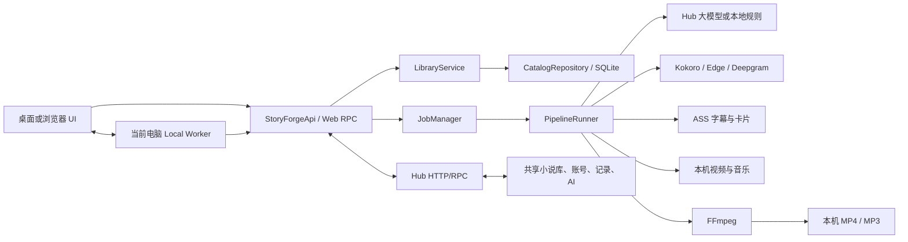

# StoryForge Studio v1.0.1 项目接手与功能嫁接说明

本文是 v1.0.1 的权威技术接手文档。旧 0.x 交付报告、临时路径、历史哈希和已经下线的 UI 流程不再构成当前合同。

## 1. 接手结论

StoryForge 是一个 Windows 优先的小说推文批量生产系统，采用“Hub 集中资料与 AI、制作电脑本地媒体处理”的结构：

- Hub 保存小说库、平台、口令、成员、设备、制作草稿、生产记录和审计数据。
- Hub 承担联网大模型文本能力；员工电脑不需要各自配置一套大模型。
- 每台制作电脑读取自己的视频/音乐目录，在本机完成配音、字幕、FFmpeg 渲染和最终输出。
- 桌面窗口、Hub 网页和制作电脑本机网页使用同一套前端与账号权限。
- 最终成品只保存在制作电脑；Hub 保存任务状态、错误、产物元数据和统计，不集中存储视频。
- 当前优先级是稳定、可诊断、串行重型任务和可恢复，不追求多条视频同时占满显卡。

新项目接手时不建议重写整套应用。优先复用 `LibraryService`、统一 RPC 合同、`PipelineRunner`、字幕/媒体纯服务和数据库仓储，再按目标系统替换 UI 或调度层。

## 2. 当前产品范围

### 2.1 已实现

1. 小说资料
   - TXT、DOCX、粘贴文本导入。
   - 自动语种检测、章节识别、正文去重和内容哈希去重。
   - 小说标题、简介、封面、标签、题材、原始章节和可选分集。
   - 短章节可人工合并，长章节可按自然边界拆分；制作台由员工勾选本批实际使用的分集。
2. 推广资料
   - 多平台档案。
   - 小说与平台绑定。
   - 每个绑定下多个历史口令；每批由员工选择。
   - 发布账号只做人工登记与待分配，不自动登录或发布。
3. 文本与内容
   - 英文和多语种正文读取。
   - 大模型润色、钩子、简介卡短文案和题材分类。
   - 大模型不可用时可回退本地规则；回退会留痕。
   - 章节标题不朗读、不显示字幕，只保留自然停顿。
4. 配音
   - Kokoro 本地离线、Edge TTS、Deepgram Aura。
   - 同批固定一个女声，可按小说重新选择。
   - 220/240/260/280 WPM 和 200–280 WPM 自定义试听。
   - 逐句缓存和失败续作。
5. 视频
   - 9:16、1080×1920、H.264、默认 60 FPS。
   - 员工选择本机视频目录，递归读取兼容素材。
   - 多素材拼接、循环、镜像、裁切、随机起点、0.8–3.0 倍固定速度。
   - 删除素材原声，完整画面使用模糊背景适配竖屏。
   - 背景音乐可关闭、自动/随机或手动选择；支持人声侧链压低。
6. 视觉
   - 顶部口令卡全程展示并限制在安全区。
   - 简介卡开关、出现时长、样式、颜色和自适应高度。
   - 封面故事卡支持真实小说封面、两段简介和卡内口令。
   - 整句字幕、单词逐个出现、逐词高亮及多套稳定可读样式。
   - 可选封面全屏结尾与舒缓动效；结尾 CTA 由旁白与字幕完成，不再叠加旧平台白卡。
7. 生产
   - 三种制作方式、连续提交批次、持久队列、失败跳过。
   - 批次归档、筛选、刷新、重试、取消、回收站和管理员永久删除。
   - 素材成功使用计数和小说累计成功视频数。
8. 协同
   - 管理员/员工两种角色。
   - 账号密码登录，新电脑登记和管理员标记。
   - Hub 与员工电脑协议兼容检查。
   - 核心程序更新、语言组件更新、哈希校验、原子安装和回滚。

### 2.2 明确不包含

- 自动登录、自动上传或管理 TikTok 账号。
- 平台合规审核。
- 把员工素材和成品上传到 Hub。
- 多台不同地点设备之间的实时文件同步。
- 默认并行多个重型 FFmpeg 任务。
- 依赖外部剪映资源或未明确许可的商业模板文件。

## 3. 技术栈与版本合同

| 项目 | v1.0.1 合同 |
| --- | --- |
| 运行系统 | Windows 10/11 x64 |
| Python | 3.11–3.12；本地 Kokoro 不使用 3.13 |
| 桌面壳 | pywebview + Edge WebView2 |
| 前端 | 原生 HTML/CSS/JavaScript |
| 数据库 | SQLite，Catalog Schema `14` |
| 设置 | JSON，Settings Schema `20` |
| 生产预设 | JSON/SQLite，Preset Schema `5` |
| Hub 协议 | `1` |
| Local Worker/浏览器协议 | `3` / 最低 `3` |
| RPC 合同 | `1` |
| 视频 | FFmpeg 7.1 运行时，H.264，1080×1920，默认 60 FPS |
| 配音输出 | MP3；内部合成使用 WAV |
| 测试 | Python unittest + Node 语法检查 + 冻结包冒烟 |

`storyforge/__init__.py` 是应用版本唯一来源；`pyproject.toml` 动态读取该值。不要在 UI 或打包脚本新增第二个版本常量。

## 4. 总体架构



### 4.1 Hub 主机职责

- 运行 Hub HTTP 服务和团队网页。
- 保存共享 Catalog、平台口令、成员、设备和生产记录。
- 提供大模型文本服务代理和共享封面下载。
- 发放本机 Worker 短期浏览器票据。
- 保存 3 日滚动业务备份。
- 可发布核心更新和语言组件，但“上传 GitHub Release”本身不会自动下发。

### 4.2 员工制作电脑职责

- 账号密码登录 Hub 并登记设备。
- 保存本机文件夹、TTS、FFmpeg、GPU 和输出偏好。
- 读取本机视频/音乐，完成本机试听和渲染。
- 把状态、错误摘要、素材使用和产物元数据回写 Hub。
- 最终文件只写入员工选择的输出目录。

### 4.3 网页端边界

Hub 网页可以展示共享资料与业务页面，但浏览器没有 Windows 任意磁盘权限。需要文件选择、试听、TTS、FFmpeg 或打开输出目录时，网页通过短期票据连接访问者当前电脑的 Local Worker。若本机服务未运行，资料查看仍可用，媒体操作会明确提示本机能力未连接。

## 5. 源码目录与模块职责

| 路径 | 职责 |
| --- | --- |
| `run.py` | 源码启动入口、诊断入口 |
| `storyforge/main.py` | 桌面程序装配、窗口与服务生命周期 |
| `storyforge/api.py` | 桌面桥、前端业务门面、Hub/本机运行态协调 |
| `storyforge/web.py` | 团队网页、本机网页、登录、CSRF 和 RPC HTTP 层 |
| `storyforge/hub.py` | Hub 服务端、客户端、鉴权、文件传输和文本代理 |
| `storyforge/worker.py` | Local Worker、设备会话、资源准入、本机文件夹与媒体 RPC |
| `storyforge/rpc_contract.py` | RPC 方法、权限和跨端兼容的唯一注册表 |
| `storyforge/catalog.py` | SQLite 建表、迁移、事务和业务仓储 |
| `storyforge/library_service.py` | 小说库 DTO、导入、分类、分集、草稿和任务计划 |
| `storyforge/jobs.py` | 持久队列、租约、进度、重试、取消和归档 |
| `storyforge/pipeline.py` | 单任务生产编排、缓存、发布事务、失败恢复 |
| `storyforge/providers/text.py` | 本地/云端文本服务适配 |
| `storyforge/providers/tts.py` | TTS 适配、模型进程、缓存和音频标准化 |
| `storyforge/services/subtitles.py` | ASS 字幕、口令卡、简介卡和几何合同 |
| `storyforge/services/media.py` | FFmpeg 命令规划、视频/音频输入和叠加 |
| `storyforge/services/manuscript_import.py` | TXT/DOCX 导入和章节解析 |
| `storyforge/services/language_detection.py` | 自动语种检测 |
| `storyforge/services/quality.py` | 发布前快速质检 |
| `storyforge/production_presets.py` | 员工方案与迁移 |
| `storyforge/style_options.py` | 可选样式目录与默认值 |
| `storyforge/updater.py` | 核心程序更新、校验、原子替换和回滚 |
| `storyforge/component_updater.py` | 语言组件清单、校验、安装和回滚 |
| `storyforge/backup.py` | Hub 业务数据窄备份、检查和恢复 |
| `storyforge/maintenance.py` | 可再生缓存、旧工作目录和日志生命周期 |
| `ui/` | 桌面/网页共享界面 |
| `scripts/` | 构建、更新包、诊断、备份恢复和验收脚本 |
| `tests/` | 单元、集成、协议、流水线、更新和稳定性测试 |

## 6. 数据与所有权

### 6.1 数据根目录

用户首次启动选择 `<StoryForgeData>`。所有可变程序数据都必须位于其中，不得继续散落到固定 C 盘路径。

```text
<StoryForgeData>\
├─ settings.json
├─ storyforge-catalog.sqlite3
├─ logs\
├─ render-work\
├─ cache\tts\
├─ components\
├─ updates\
├─ hub-backups\
└─ webview\
```

视频素材、音乐和最终输出由员工在制作电脑自行选择，不属于 Hub 管理目录。

### 6.2 Catalog 主要实体

- `sites`：Hub 站点。
- `software_users`、`user_permissions`：账号、角色与逐项覆盖。
- `hub_devices`：真实制作设备和最后在线状态。
- `device_config_revisions`、`device_config_targets`：受控设备设置版本。
- `platforms`：推广平台。
- `novels`、`content_revisions`、`chapters`、`episodes`：小说、正文版本、章节和分集。
- `novel_platform_bindings`、`promo_codes`：小说平台绑定与口令。
- `publishing_accounts`：人工发布账号资料。
- `production_drafts`、`draft_episodes`：本批配置与所选分集。
- `production_batches`、`production_records`、`production_record_attempts`：批次、视频任务和尝试记录。
- `artifacts`：最终产物元数据。
- `media_usage_events`：成功使用素材事件。
- `audit_events`：管理操作审计。

### 6.3 删除语义

- 管理员可删除小说、平台、口令、发布账号、成员和设备。
- 与历史生产记录有关的实体使用软删除、快照或 `SET NULL` 保留追溯，不允许破坏已完成记录。
- 最后一个有效超级管理员受到保护。
- 生产记录先进入回收站，再由管理员永久删除。

### 6.4 备份语义

Hub 备份保存共享业务数据和必要配置，不备份员工素材、缓存、渲染工作区或最终视频。默认保留 3 日；同一内容以指纹去重，恢复可选择完整替换。选择替换时，小说及其平台绑定和全部口令一起替换，不与另一套小说库合并。

## 7. 小说导入与分集

1. 读取 TXT/DOCX/粘贴文本并统一编码、换行和空白。
2. 计算正文摘要用于重复检测。
3. 检测语言并保存置信度；语言只影响推荐和配音筛选，不改变原文。
4. 解析显式章节标题；章节标题本身不进入旁白或字幕。
5. 建立原始章节和可选分集。
6. 制作时员工勾选分集，系统按原顺序合并为一段本批正文。
7. 同一批选中全部分集时只生成一个连续正文，不加入上集回顾；跨批次续集才允许在开头加入上一批回顾。

题材分类用于文案、女声和音乐建议，不再用于强制匹配视频素材目录。员工选择的目录中只要存在可解码视频即可制作。

## 8. 一页制作台合同

制作页采用渐进展开并记住本机上一次有效选择。核心区域：

1. 内容：小说、平台、口令、发布账号、分集、生成数量。
2. 配音与节奏：TTS 服务、故事类型、女声、WPM、背景音乐。
3. 字幕与画面：模板、简介卡、字幕、口令卡、封面结尾、FPS、素材速度。
4. 素材与输出：视频目录、音乐目录、已有配音、输出目录。

页面上的缺项摘要可点击并定位到对应区域。批次加入队列后，当前已提交任务继续使用冻结快照；表单清空本批口令/账号/分集并保留风格、声音、节奏和本机目录，员工可以立即配置下一批。

## 9. 三种生产模式

### 9.1 常规视频生成

- 输入：正文、女声、视频素材，可选背景音乐。
- 输出：每个变体一条最终 MP4。
- 不额外把旁白 MP3复制到发布目录。

### 9.2 仅生成配音

- 输入：正文和女声。
- 输出：整批一份最终 MP3。
- MP3 写入字幕时间索引和 StoryForge 元数据，供后续换素材复用。

### 9.3 已有配音更换素材

- 输入：StoryForge 生成的 MP3、视频素材，可选背景音乐。
- 复用 MP3 中的正文、时间索引、女声和语速信息。
- 输出：新 MP4，不重复调用 TTS。

## 10. 生产流水线

当前 `PipelineRunner._run_job` 仍是串行编排入口。接手团队可以内部拆阶段，但在完成阶段级回归前不要改变执行顺序。

```text
冻结批次配置
→ 读取并验证正文
→ 文本润色/本地回退
→ 生成或读取旁白
→ 拼接音频并生成时间轴
→ 生成 ASS 字幕/口令卡/简介卡
→ 选择并预检视频、音乐
→ 生成 FFmpeg 计划
→ 编码 MP4 或导出 MP3
→ 快速质检
→ 原子发布最终文件
→ 记录产物、小说成功数和素材使用
→ 清理大体积中间文件
```

### 10.1 资源与稳定性

- 每台制作电脑默认只运行一个重型任务。
- 开始前检查可用内存、输出盘可写性和空间。
- NVENC/AMF/QSV 失败可按错误类型回退 CPU；不会对所有失败盲目重试。
- 内存不足时使用低内存素材预处理和受限线程。
- 连续崩溃或后台 Worker 冲突时停止拉起并生成明确诊断。
- 进度来自 FFmpeg 机器可读进度和真实阶段，不用假进度条。

### 10.2 失败与原子发布

每条任务拥有独立 `render-work/<batch>/<job>`。最终文件先写入 staging；渲染和质检通过后才原子移动到发布目录。发布事务带日志，可在程序重启后恢复或回滚。失败任务保留必要的 `job-error.log`/`render-error.log`、清单和命令摘要；其他大体积中间文件按维护策略清理。

## 11. 视频素材与去重

- 只递归扫描员工本批选择的视频素材目录。
- 扫描结果按目录指纹缓存；目录没有变化时不重复完整探测。
- 不按小说题材强制进入“悬疑/浪漫”等子目录。
- 选择策略以“让同批每条成品不同”为目标：素材组合、起始位置、镜像、裁切、顺序和速度形成确定性变体。
- 素材不足时按员工选择的策略拼接、循环和变体；不因“唯一素材用过”直接失败。
- 只有最终质检成功后才增加使用次数，失败尝试不污染统计。
- 不做昂贵的画面相似度扫描，也不为视频重新配重。

## 12. 配音与字幕

### 12.1 TTS

- Hub 大模型与员工本机 TTS 是两类能力，不应混为一体。
- Kokoro 本地完整包适合离线兜底；Edge TTS 依赖网络；Deepgram 依赖账号额度。
- 候选声音由当前供应商和语种实时返回，不能用不存在的静态 Voice ID 填满三个候选。
- 相同文本、供应商、模型、声音和 WPM 使用逐句缓存。
- 语速变化触发短试听，不会默默把旧试听当成新速度。

### 12.2 字幕

- 默认按语义停顿形成整句字幕。
- 单词逐个出现和逐词高亮是行为层，不再伪装成重复的视觉预设。
- 已下线的旧“逐词弹出/底部极简”ID只在迁移层读取，并映射到当前清晰预设；新 UI 不显示。
- 字幕重新断句以阅读节奏为准，必须与最终旁白时间轴一致。

### 12.3 口令卡与简介卡

- 顶部口令卡全程显示，文本垂直/水平居中并限制在安全区。
- 封面故事卡把完整 `Search "口令"` 文案纳入宽度计算；24 个高宽字符的合法边界也不能溢出。
- 简介卡文案优先取小说简介并经 AI 压缩为短、真实、可读的钩子，禁止虚构正文不存在的核心事件。
- 简介卡高度随字符量分档，所有坐标由同一几何合同生成；即时预览和正式 ASS/FFmpeg 使用相同归一化参数。
- 两个封面故事卡保留：深色封面故事卡、电影黑卡。两者支持真实封面、两段简介、卡内口令和自由配色。
- 关闭简介卡后不会单独占用开头几秒显示小说封面。

## 13. 输出合同

员工可见目录：

```text
<Output>\待发布\<平台>_<口令>_<小说>_B<批次短ID>\
```

其中只保留：

- 常规/换素材模式：最终 `.mp4`。
- 仅配音模式：最终 `.mp3`。

文件名包含批内序号、平台、口令、所选分集范围、变体号和批次短 ID，确保批量复制时仍可追溯。发布目录不包含 ASS、WAV、JSON、日志、原稿或缓存。

## 14. 队列、记录和状态

主要状态定义在 `storyforge/models.py::JobStatus`。终态为 `completed`、`failed`、`cancelled`；其余为准备、文本、配音、画面、编码和确认阶段。

队列按批次提交顺序处理。当前批在制作时，员工可继续配置并提交下一批。单条失败不会阻塞同批或后续批次。生产页以批次为第一层，不无限展示平铺“胶片带”；可按状态、小说、批次、成员、电脑和日期筛选，并提供刷新。

Hub 的生产记录是业务事实，员工本机队列是执行事实。租约和 generation 防止同一任务被两台电脑重复执行；网络恢复后通过 reconciliation 修复短暂不一致。

## 15. 权限模型

代码内部角色：

- `admin`：管理员。
- `producer`：员工。

管理员默认拥有全部已知权限。员工默认可以查看资料、使用口令、创建草稿、试听、制作、查看/重试/归档自己的记录和管理自己的方案；不能管理小说正文、平台口令、成员、Hub、全部记录或团队更新。

权限按 RPC 调用实时计算，账号停用、密码修改或权限变化会撤销旧会话。最后一个拥有 `users.manage`、`permissions.manage`、`hub.manage` 的有效管理员不能被删除或降权。

完整权限表只维护在 `storyforge/rpc_contract.py` 与 `storyforge/catalog.py`。前端显示隐藏不是安全边界。

## 16. RPC 与 API 合同

### 16.1 统一结果外壳

桌面与 Web 方法返回统一结构：

```json
{"ok": true, "data": {}}
```

失败：

```json
{"ok": false, "error": {"code": "...", "message": "...", "details": {}}}
```

调用方只依赖稳定的 `code` 和结构化 `details`，不要解析自然语言错误文本。

### 16.2 合同来源

- Catalog 方法集合：`CATALOG_READ_METHODS` / `CATALOG_WRITE_METHODS`。
- Hub 权限：`HUB_RPC_PERMISSION_ANY`。
- Web 权限：`WEB_RPC_PERMISSIONS`。
- Local Worker 权限：`LOCAL_WORKER_RPC_PERMISSIONS`。
- 浏览器必须在当前电脑执行的方法：`CLIENT_LOCAL_MEDIA_METHODS`。

增加 RPC 时必须同时：

1. 在注册表登记方法与权限。
2. 实现服务端分发。
3. 实现客户端/前端调用。
4. 更新协议测试。
5. 判断滚动升级时旧 Hub、旧 Worker 或旧网页的行为。

### 16.3 兼容策略

v1.0.1 仍兼容旧设备发送不含 `selection_key` 的声音候选；新客户端会按 Hub 公布的能力字段投影请求，连接未公布清单的旧 Hub 时使用兼容字段集。服务端仍严格拒绝未声明字段，不允许吞掉其他 400 错误。

## 17. 配置与预设

全局默认、员工个人方案和本批覆盖按以下优先级合并：

```text
团队默认 < 员工保存方案 < 当前批次覆盖
```

- 管理员可删除所有方案。
- 员工可新增、修改和删除自己的方案。
- 软件不再强塞内置“团队方案”到员工下拉框；视觉样式目录仍作为字段选项存在。
- 每次成功提交后保存本机上次选择，下一批默认沿用。
- 旧字幕预设通过 Schema 迁移为当前可见样式，不丢失颜色/描边等已保存视觉参数。

## 18. 更新、发布和回滚

### 18.1 核心程序

完整 onedir ZIP 是新安装与修复的唯一包体。包中包含 EXE、`_internal`、FFmpeg、必要本地 TTS、连接配置、快速说明和管理工具；不包含 `StoryForgeData`。

更新清单包含版本、大小、SHA-256 和发布说明。客户端下载到数据目录 staging，校验后在安全重启点原子替换，并保留上一版回滚。正在渲染时不安装。

GitHub Release 仅保存正式制品供管理员下载，不等于 Hub 发布。v1.0.1 首次交付默认由管理员手动发给员工；确认员工下班并完成真机冒烟后，再决定是否在 Hub 发布自动更新清单。

### 18.2 语言组件

语言组件安装到 `<StoryForgeData>/components`，拥有独立版本、应用兼容范围和逐文件 SHA-256。核心 ZIP 不覆盖组件；组件也不能替换核心 EXE。组件安装使用安全解压、原子切换和上一版回滚。

## 19. 安全边界

- 密码只以强哈希形式保存在 Hub，不写入员工包或 Git 仓库。
- 设备凭据由账号密码首次登录取得，并用当前 Windows 用户 DPAPI 保护。
- API Key 使用 DPAPI，不进入日志、支持包或 GitHub。
- Web 使用 HttpOnly 会话、CSRF、Origin 校验、限流和方法级权限。
- 文件下载/上传使用根别名、规范化相对路径、大小限制和哈希，禁止任意绝对路径穿越。
- ZIP 安装防 Zip Slip、拒绝符号链接/重解析点和 `StoryForgeData` 目标。
- 支持包默认脱敏，仍可能包含小说片段或供应商错误尾部，外发前需人工确认。

## 20. 测试与发布门禁

测试层级：

1. 单元：模型、配置、文本、TTS、字幕和媒体纯函数。
2. 集成：Catalog、Hub、Web、Worker、队列、更新与生产流程。
3. 冻结包：启动、数据库迁移、WebView/Python.NET、FFmpeg、本地 Kokoro。
4. 稳定验收：冻结 EXE 真实长渲染、编码器确认、内存回落和包体绑定。
5. 独立包冒烟：从最终目录重新启动并核对哈希。

正式版必须同时满足：

- 全量 unittest 零失败。
- `node --check ui/app.js`。
- `git diff --check`。
- 冻结启动和 Kokoro 自检。
- 至少 600 秒稳定性验收。
- 最终 ZIP Manifest 与 SHA-256 校验。
- 构建机以外至少一台员工电脑完成真实 MP4 冒烟。

## 21. 推荐嫁接方式

### 21.1 首选：保留服务边界

目标系统把 StoryForge 当作本地生产服务：

- 使用 Hub RPC 读取小说/平台/口令和写入记录。
- 使用 Local Worker RPC 选择本机文件、试听和排队。
- 不直接操作 SQLite，不从 UI DOM 抽数据。
- 复用 `rpc_contract.py` 生成调用白名单和权限说明。

优点是更新风险最低，原有队列、租约、权限、日志和恢复机制继续有效。

### 21.2 Python 进程内复用

若新项目同为 Python，可依次装配：

1. `AppSettings` / `ConfigRepository`。
2. `CatalogRepository`。
3. 文本与 TTS provider factory。
4. `LibraryService`。
5. `PipelineRunner`。
6. `JobManager`。

必须保留原子发布、工作目录隔离、取消令牌、资源准入和质量检查；不能只调用 `_run_job` 中间某段并把半成品当最终文件。

### 21.3 可独立抽取的能力

- 语种检测与正文导入。
- 字幕切分、ASS 生成和安全区几何。
- 简介卡/口令卡布局计算。
- FFmpeg 媒体预检与命令规划。
- 更新包校验与安全解压。
- 支持包脱敏。

这些模块比直接复用桌面桥更适合作为新项目的库。

## 22. 接手时不要做的事

- 不要把 SQLite 换库作为第一项工作。
- 不要把原生前端整体重写为 React/Vue 再验证业务。
- 不要立刻开启多任务并行渲染。
- 不要给所有网络/FFmpeg 错误统一无限重试。
- 不要删除租约、原子发布、硬取消、更新回滚或旧 Schema 迁移。
- 不要把视频素材使用次数误解为“素材用过就禁止”；目标是成品差异化，不是耗尽目录。
- 不要让 Hub 代员工电脑渲染所有视频，否则主机成为瓶颈。

## 23. 后续重构优先级

1. 在不改变行为的前提下，把 `PipelineRunner._run_job` 拆成有阶段结果的串行步骤。
2. 把 `CatalogRepository` 按账号、设备、内容、任务、记录拆内部仓储，继续共用一个事务入口和 SQLite。
3. 把 `StoryForgeApi` 内部拆为应用服务，但保持公开方法和 RPC 名称不变。
4. 将 TTS 供应商、声音目录、缓存和本地运行时进一步分离。
5. 从统一 RPC 注册表生成前端方法表、权限说明和协议测试。
6. 为阶段耗时、资源峰值、编码器回退和崩溃链路增加结构化指标。

这些是可维护性优化，不是 v1.0.1 交付阻塞项。

## 24. 新项目接手清单

- [ ] 阅读 README、本报告、部署说明和发布门禁。
- [ ] 在干净目录克隆仓库，不携带旧 build/dist。
- [ ] 确认 Python 3.11/3.12、WebView2 和 FFmpeg 打包环境。
- [ ] 运行全量测试并保存摘要。
- [ ] 使用临时 `StoryForgeData` 启动源码，不接触生产数据库。
- [ ] 导出或取得正式备份，在副本上验证恢复和 Schema 14。
- [ ] 通过 RPC 读取小说库并建立一条测试草稿。
- [ ] 分别验证常规 MP4、仅 MP3、已有 MP3 换素材。
- [ ] 验证员工权限无法修改小说/口令，管理员删除有审计。
- [ ] 验证网页在本机 Worker 在线/离线时的两种提示。
- [ ] 生成冻结包、运行 600 秒稳定门禁和独立包冒烟。
- [ ] 在一台非构建机完成真实素材测试后再分发。

## 25. 交接文件索引

- `README.md`：项目入口。
- `docs/STORYFORGE_INTEGRATION_REPORT.md`：本权威合同。
- `docs/PRODUCT_REQUIREMENTS.md`：产品需求边界。
- `docs/PRODUCTION_WORKFLOW_FINAL_BASELINE.md`：制作字段与流程。
- `docs/DEPLOYMENT_WINDOWS.md`：安装与协同。
- `docs/WEB_ACCESS.md`：网页端边界。
- `docs/AUTO_UPDATE.md`：更新协议。
- `docs/RELEASE_GATES.md`：测试与发布门禁。
- `docs/V1.0.1_RELEASE.md`：正式制品与验证证据。
- `storyforge/rpc_contract.py`：可执行 RPC 权限合同。
- `tests/`：真实兼容和业务行为的最终证据。
