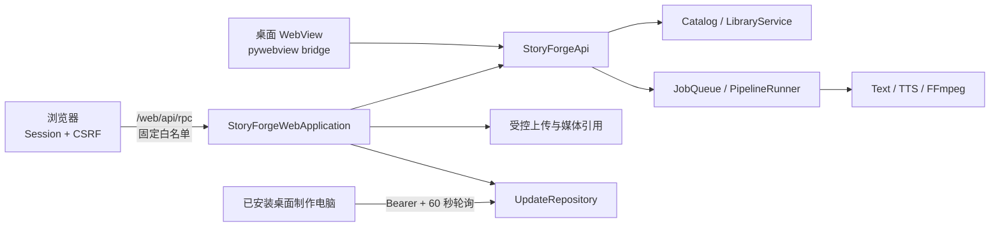

# StoryForge Studio 0.3.0 发布与嫁接摘要

> 发布基线日期：2026-07-25  
> 源码版本：`storyforge.__version__ == "0.3.0"`  
> Windows 入口：`StoryForge Studio.exe`  
> Catalog Schema：8；设置 Schema：10；成片/样片 Manifest：2；更新 Manifest/包元数据：1  
> 详细设计：[STORYFORGE_INTEGRATION_REPORT.md](STORYFORGE_INTEGRATION_REPORT.md)  
> 网页操作：[WEB_ACCESS.md](WEB_ACCESS.md)  
> Windows 部署：[DEPLOYMENT_WINDOWS.md](DEPLOYMENT_WINDOWS.md)  
> 更新协议：[AUTO_UPDATE.md](AUTO_UPDATE.md)

## 1. 本版结论

0.3.0 的主要发布增量是**带真实账号与权限边界的浏览器全功能模式**。一台 Windows 主机运行 StoryForge Hub 后，其他电脑可直接用浏览器完成资料维护、批次配置、候选配音、样片审核、整批制作、进度查看、失败重试和产物下载；管理员还可维护团队、网页安全目录并发布桌面客户端更新。

网页不是另一套业务实现：它复用桌面端的 `StoryForgeApi`、Catalog、LibraryService、队列、TTS、FFmpeg 与更新仓储。普通浏览器只负责交互，计算和文件读写仍发生在 Hub 主机。

本版没有加入 TikTok 自动登录、上传、发布或合规检查；没有把 Hub 变成公网 SaaS；没有实现通用分布式 Worker 调度；也没有把当前内部桥接接口承诺为稳定公共 API。

## 2. 运行拓扑



启动形态：

- 桌面模式：启动 `StoryForge Studio.exe`，同一进程提供 WebView 和已配置的 Hub/网页入口。
- 无窗口 Hub：`StoryForge Studio.exe --web`。
- 临时监听覆盖：`--web-host ADDRESS --web-port PORT`，只影响本次运行，不修改持久设置。
- 源码模式：`python .\run.py --web`。

主机退出后网页立即不可用；浏览器关闭不会取消已经提交到主机队列的任务。

## 3. 浏览器功能合同

### 3.1 真实业务能力

- 小说 TXT/DOCX/粘贴导入、正文版本、简介、封面、语种、题材和分集维护。
- 平台、Logo、口令与人工发布账号管理。
- 可视化选书、分集选择、总视频数、女声、节奏、字幕、四类卡片、素材、音乐、输出与 60/30 FPS 配置。
- 最多 3 个真实女声候选试听；30 秒样片生成、播放、重新生成与审批。
- 整批加入队列、开始/停止、状态查看、失败跳过与重试。
- 样片、旁白、成片和 Sidecar 通过授权媒体引用播放或下载；媒体播放支持 HTTP Range。
- 管理员维护成员、权限、设备令牌、Hub 设置和软件更新。

正常 `/` 地址使用真实服务；连接失败不会自动回退到 Mock。只有显式 `?demo=1` 用于无真实数据的前端演示。

### 3.2 HTTP 入口

| 方法与路径 | 认证 | 用途 |
| --- | --- | --- |
| `GET /` | 无 | 静态 UI；业务数据仍需登录 |
| `GET /health`、`GET /web/api/health` | 无 | 最小健康状态 |
| `POST /web/api/session/login` | 账号 + 密码或成员令牌 | 建立网页会话 |
| `GET /web/api/session` | Session | 恢复会话与 CSRF |
| `DELETE /web/api/session` | Session + CSRF | 退出 |
| `POST /web/api/session/password` | Session + CSRF | 设置或修改网页密码 |
| `POST /web/api/rpc` | Session + CSRF | 调用固定业务白名单 |
| `POST /web/api/upload?kind=...` | Session + CSRF + 权限 | 受控文件上传 |
| `GET /web/api/media?ref=...` | Session | 会话绑定媒体流 |
| `GET /web/api/download?ref=...` | Session | 下载已授权产物 |
| `POST /rpc`、`GET/PUT /files/...` | Bearer | 传统桌面客户端 Catalog/文件协同 |
| `GET /updates/manifest`、`GET /updates/package` | Bearer | 桌面客户端更新检查与下载 |

网页 RPC 继续使用现有 `{ok,data,error}` 桌面结果结构，但外层 HTTP 会返回稳定类别，如 `validation_error`、`forbidden`、`catalog_not_found` 和 `catalog_conflict`。它没有 `/v1` 版本承诺，不能直接作为长期公网 API。

## 4. 认证、角色与权限

### 4.1 登录与密码

- 第一次登录可在密码框粘贴属于该成员的有效 Hub Token；用户名必须与 Token 绑定成员一致。
- 设置网页密码后，服务端只保存随机盐 + 600,000 次 PBKDF2-SHA256 verifier，不保存明文。
- 密码长度为 10–512，至少包含字母和数字。
- 会话 ID 使用 HttpOnly、SameSite=Strict Cookie；普通会话最长 12 小时，“保持登录”最长 30 天。
- CSRF Token 由已认证会话接口返回并保存在当前页面内存；所有写请求必须同时提交。
- 修改密码会撤销该账号除当前会话外的其他网页会话。
- 停用账号会使全部会话失效；撤销 Token 会立即使由该 Token 建立且仍依赖它复验的会话失效。纯密码会话不应被描述为依赖某个设备 Token。
- 登录限制为每来源 IP 每分钟最多 30 次请求；同一账号/IP 连续失败会指数退避。进程最多保存 512 个会话、单 IP 最多 32 个。

当前会话保存在 Hub 进程内存中，重启 Hub 会要求重新登录。Cookie 在默认 HTTP 模式下没有 `Secure` 属性；若嫁接到正式 HTTPS，应在应用或可信代理层补齐 Secure Cookie、可信代理头策略和持久会话/统一身份方案。

### 4.2 两类角色

| 角色 | 默认权限范围 |
| --- | --- |
| 管理员 `admin` | 全部资料、平台、口令、账号、团队、Hub、安全目录、全队列和更新发布 |
| 员工 `producer` | 查看可用资料，使用口令，创建自己的草稿，审核、查看和重试自己的任务 |

账号级覆盖为 `true / false / null`：额外允许、明确禁止、继承角色。服务端每次 RPC 重新读取账号与有效权限，并按草稿、生产记录和任务所有权过滤结果；前端隐藏按钮不是安全措施。系统禁止停用或降级最后一位同时拥有 `users.manage + permissions.manage + hub.manage` 的有效管理员。

传统 Bearer RPC 会把 Token 绑定用户重新注入为 actor。网页 RPC 同样由服务端注入 actor，并拒绝任意反射调用；新增桌面桥接方法不会自动成为局域网页面能力。

## 5. 网页安全目录与上传

### 5.1 默认工作区

Hub 首次启用网页时建立：

```text
%APPDATA%\StoryForgeStudio\web-workspace\
├─ videos\
├─ music\
└─ output\
```

管理员可以再登记主机已有素材根目录。允许根必须是已存在的主机本机目录；拒绝磁盘根、UNC/网络共享、设备路径、备用数据流、通配符和根外路径。批次保存以及加入队列时都会重新验证 `video_folder / music_folder / output_folder`。

网页不会列出整块磁盘、打开主机资源管理器或读取访问者电脑的本地文件。需要使用的素材必须先位于 Hub 主机的安全目录内。

### 5.2 上传合同

| `kind` | 扩展名 | 单文件上限 | 所需能力 |
| --- | --- | ---: | --- |
| `novel`、`summary` | TXT/DOCX | 20 MB / 50 MB | `library.edit` |
| `cover` | JPG/JPEG/PNG/WEBP | 20 MB | `library.edit` |
| `platform_logo` | JPG/JPEG/PNG/WEBP | 20 MB | `platforms.manage` |
| `update_package` | ZIP | 2 GB | `hub.manage` |

上传使用 `multipart/form-data`，每次一个文件。后端检查请求长度、kind/扩展名、文件签名；DOCX 还检查异常压缩结构。文件写入按 actor 隔离的随机临时目录，并返回 `upload:<opaque-id>`。只有白名单方法的指定参数位会把该句柄解析为主机路径；句柄与 actor、会话、用途和有效期绑定。

本机媒体路径不会直接返回浏览器，而是改写成随机媒体引用；每个会话最多 256 个引用。其他账号、其他会话或过期引用不能复用。嫁接到对象存储时，应把这一能力模型映射成短期签名资源 ID，而不是暴露路径。

## 6. 远程更新合同

管理员可从 Hub 桌面或网页上传完整更新 ZIP，填写同一 SemVer 与说明并调用 `publish_update()`。网页上传入口受 `hub.manage` 和受控 `upload:` 句柄保护；最终仍由 Hub 主机上的 `UpdateRepository` 执行结构、版本、入口和摘要检查。

桌面制作电脑更新流程：

1. 默认每 60 秒带自己的 Bearer Token 请求 Manifest。
2. 仅接受严格高于本机版本的 SemVer，并验证 Token-HMAC。
3. 自动下载到 `%APPDATA%\StoryForgeStudio\updates\downloads`，校验长度、SHA-256、ZIP 安全路径、内部版本和入口。
4. 使用者选择“下次重启安装”；渲染忙时保持 `deferred`。
5. 桌面安全退出后，外部 PowerShell Worker 再验摘要、隔离解压、备份、覆盖并在失败时恢复已覆盖文件。

它是周期轮询 + 重启安装，不是 WebSocket 推送或运行中热替换。Hub 主机不会消费自己发布的更新；应先用完整目录人工升级主机。更新包不删除新包未包含的旧文件，也不是整个安装目录的原子版本切换。

普通浏览器不下载桌面更新包。网页资源来自 Hub；主机升级后刷新页面即可取得当前 UI。当前 `ui/index.html` 的静态资源查询版本为 `v20`。

## 7. 局域网、VPN 与公网边界

- 推荐：可信专用局域网，Windows 防火墙仅允许专用网络访问 TCP 8765。
- 异地：先建立受控 VPN，再通过主机 VPN 地址访问；StoryForge 不负责 NAT 穿透或异地 Hub 数据同步。
- 禁止：把 8765 直接做公网端口映射。
- 公网产品化：增加 HTTPS 反向代理、集中身份/SSO、Secure Cookie、可信代理与真实来源 IP 规则、速率限制、审计、备份、WAF/上传扫描、独立发布私钥签名和 Authenticode。

当前 HMAC 的密钥是设备 Bearer Token，不是离线发布私钥；它不能在明文 HTTP 被监听、Token 泄漏或 Hub 失陷时提供独立发布者身份保证。

## 8. 嫁接接口建议

### 8.1 推荐复用

| 模块 | 嫁接用途 |
| --- | --- |
| `storyforge/catalog.py` | 资料、版本、草稿、记录、权限、审计与租约 |
| `storyforge/library_service.py` | 导入、分集、分类、女声候选和生产方案冻结 |
| `storyforge/pipeline.py` | 文本 → TTS → 字幕 → 媒体 → FFmpeg → 质检 |
| `storyforge/services/*`、`providers/*` | 文本、语音、字幕、媒体和质量能力 |
| `storyforge/web.py` | 会话、CSRF、受控上传、媒体能力和所有权校验参考 |
| `storyforge/hub.py` | 局域网 Bearer RPC、文件、租约与更新传输参考 |
| `storyforge/updater.py` | SemVer、包校验、下载缓存和安全退出安装 |

不要让目标系统直接写 SQLite，也不要把 `ui/app.js` 或 `StoryForgeApi.__dir__()` 当成业务/API 合同。

### 8.2 建议新增的正式外壳

1. 定义 `/v1` REST/IPC 或消息协议，并为 Novel、Revision、Episode、Draft、Job、Record、Artifact、Upload 和 Update 建立稳定 DTO。
2. 用目标系统身份映射 StoryForge actor；服务端强制权限和所有权，不信任客户端提交的用户 ID。
3. 为创建草稿、加入队列、审批与重试增加幂等键、机器错误码、取消、超时和事件流。
4. 将本机路径拆成 `local-path capability`、`upload asset id` 或对象存储 ID；明确哪个 Worker 可以解析哪类资源。
5. 保留生产设置完整快照、样片审批门、失败不阻断、口令历史上限、正文哈希去重以及 Manifest/Quality Sidecar。
6. 把本机串行 `JobQueue` 包装或替换为可持久恢复的 Worker 队列；当前传统 Hub RPC 本身不是通用远程渲染调度器。

### 8.3 兼容基线

- 0.3.0 沿用 Catalog Schema 8、设置 Schema 10、输出 Manifest 2 和更新 Schema 1；浏览器能力没有要求破坏既有资料库格式。
- `get_bootstrap / get_library_bootstrap / get_novel / save_production_draft / queue_production_draft` 等仍是当前桌面桥接方法，不具备长期公共版本保证。
- 四类视觉样式、19 个内置预设和 `word_pop_sync` 保持 0.2.0 合同。逐词效果仍是实际句/段 WAV 边界内按文本显示宽度确定性分配，不是声学 forced alignment。
- 团队默认样式仍落在当前电脑设置；批次快照随 Catalog 草稿共享。本机浏览器自定义快捷预设仍只在该浏览器 localStorage。

## 9. 当前发布目录检查

检查到的 v0.3.0 构建目录：

```text
release\StoryForge-Studio-v0.3.0-2026-07-25\
├─ StoryForge Studio.exe
├─ local-ai\kokoro\
├─ docs\
├─ BUILD_VALIDATION.md
├─ SHA256SUMS.txt
└─ 开始使用.md
```

冻结 EXE 已执行独立 Kokoro 自检：`status=passed`、Provider `local_kokoro`、Voice `af_heart`、24 kHz 单声道、3.2 秒 WAV，并绕过业务缓存。验收临时 WAV/JSON 已在记录结果后删除，不放进正式安装包。

已生成以下正式交付物：

- `StoryForge-Studio-v0.3.0-Windows-x64-Full.zip`：完整 Windows 安装目录；
- `StoryForge-Studio-v0.3.0-Hub-Update.zip` 与同名 Manifest：供 Hub 发布给其他制作电脑；
- `StoryForge-Studio-v0.3.0-Source-and-Integration.zip`：源码、测试、脚本与嫁接文档；
- `SHA256SUMS-v0.3.0.txt`：发布级 SHA-256 清单。

完整目录和两个二进制 ZIP 都包含同一 EXE 与 `local-ai\kokoro` 模型目录。Full ZIP 用于首次安装或人工修复；Hub Update ZIP 用于已有客户端的受控升级。

发布目录还包含 `启用网页后台服务.cmd` 与 `停用网页后台服务.cmd`。前者把无窗口 `--web` 模式注册为当前用户的 Windows 登录启动任务，并配置异常退出自动重试；因此关闭桌面窗口不会再让浏览器出现 `ERR_CONNECTION_REFUSED`。

更新包示例：

```powershell
python .\scripts\build_update_package.py `
  ".\release\StoryForge-Studio-v0.3.0-2026-07-25" `
  --entrypoint "StoryForge Studio.exe" `
  --version 0.3.0 `
  --output ".\release\StoryForge-Studio-v0.3.0-Hub-Update.zip"
```

ZIP 根目录必须直接包含 `storyforge-update.json`、`StoryForge Studio.exe` 和本版需要的 `local-ai\kokoro`，不能再套一层发布目录。

## 10. 验收与已知限制

文档冻结时的代码基线：

- `tests/test_ui_contract.py`：28 个测试方法。
- `tests/test_web.py`：16 个测试方法，覆盖登录、CSRF、白名单、权限、草稿隔离、安全目录、上传、媒体 Range、更新权限、会话限制和即时权限变化。
- UI 静态资源缓存版本：`v20`。
- 2026-07-25 已执行 `python -m unittest tests.test_ui_contract tests.test_web`：共 44 项，全部通过。

发布前建议至少执行：

```powershell
python -m unittest tests.test_ui_contract tests.test_web tests.test_hub tests.test_updater
```

以及在一台无 Python 的目标电脑执行：

```powershell
& '.\StoryForge Studio.exe' --kokoro-self-test '.\validation\kokoro'
```

仍需注意：

- Hub 业务和渲染都依赖一台主机，当前没有高可用或跨 Hub 自动复制。
- 会话位于内存，Hub 重启会退出网页账号。
- 浏览器上传不是素材库同步器；大批视频/音乐应由管理员直接复制到主机允许目录。
- 本机队列不是持久分布式队列；进程退出后的恢复粒度仍受现有任务状态机约束。
- 更新 Worker 逐文件覆盖，不是版本目录原子切换；断电或磁盘故障可能仍需完整包人工修复。
- EXE 尚未 Authenticode 签名，更新 HMAC 也不是独立发布签名。

## 11. 交接清单

嫁接或继续发布时至少交付：

- 本文、`STORYFORGE_INTEGRATION_REPORT.md`、`WEB_ACCESS.md`、`DEPLOYMENT_WINDOWS.md` 和 `AUTO_UPDATE.md`；
- `storyforge/`、`ui/`、`tests/`、`scripts/`、`StoryForge.spec` 和 requirements；
- 脱敏的 Catalog 种子库以及 Manifest、Quality Log、Preview Manifest、Artifact 样例；
- v0.3.0 Full ZIP、Update ZIP、权威版本说明和 SHA-256 清单；
- 目标系统身份/权限映射、资源 ID/路径映射和 DTO/错误码说明；
- 第三方依赖许可证、构建日志、目标电脑真实 TTS/FFmpeg/网页/更新冒烟记录。

历史 [V0.2.0_RELEASE_SUMMARY.md](V0.2.0_RELEASE_SUMMARY.md) 保留用于追溯，不应改写成 v0.3.0。
